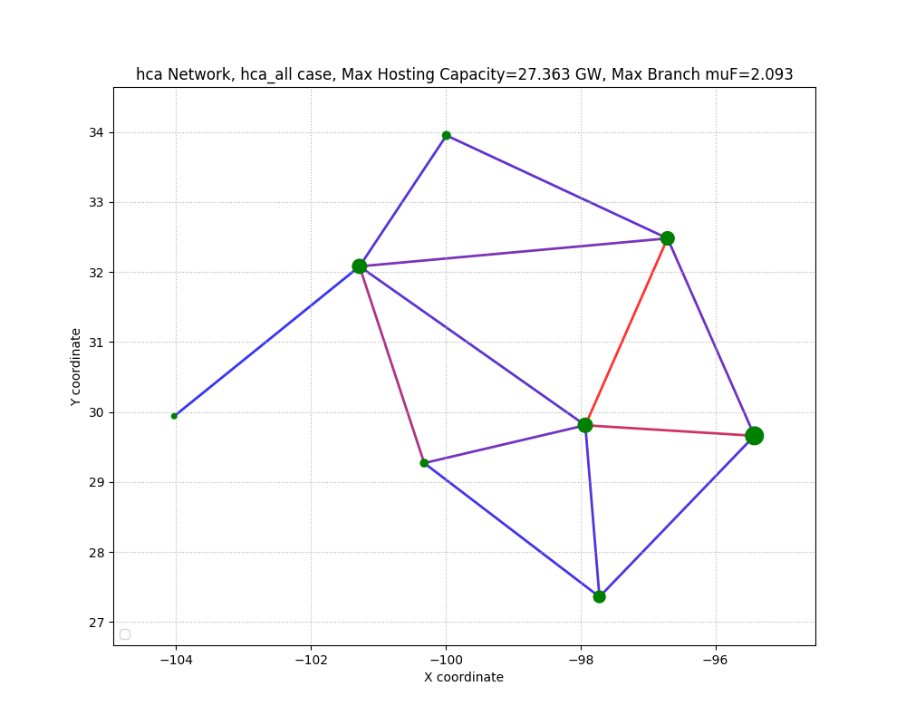

# ERCOT 8-Bus Test System for i2x 

This repository contains MATPOWER and Python scripts for an
8-bus ERCOT test system with 5 equivalent wind plants. References: 
 
- [Test System Description](https://doi.org/10.1016/j.apenergy.2020.115182).

- [Synthetic Wind Output Methodology](https://doi.org/10.1109/TPWRS.2009.2033277).

Testing has been done with MATPOWER/MOST 7.1, Octave 8.2.0, and Python 3.10.5. See *requirements.txt* for
the required Python packages and versions.

## Directory of Script and Data Files

- **\_\_init\_\_.py** allows the use of *mpow\_utilities.py* as a module from the parent directory
- **cat\_most.py** concatenates saved MOST solutions from the *msout.txt* format to numpy arrays, saved in *txt* files for *plot\_mday.py*
- **clean.bat** removes output and temporary files from executing scripts
- **hca.py** call the HCA function, as configured by a JSON file name supplied as the first command-line argument
- **hca_all.json** is a sample hosting capacity analysis configuration file that specifies a load scaling of 2.75, no grid upgrades, and all buses to be considered.
- **hca_one.json** is a sample hosting capacity analysis configuration file that specifies a load scaling of 2.75, two grid branch upgrades, and one bus to be considered.
- **hca\_prep.py** creates a table of N-1 branch contingencies for a systematic hosting capacity analysis; no grid upgrades are includes
- **hca\_test.py** performs a trial hosting-capacity analysis at bus 1 with two branches upgraded
- **make_case8_network.py** creates *hca\_network.json* from archival data files for the ERCOT 8-bus test case
- **miqps\_glpk.m** edited source file for MOST 1.1 / MATPOWER 7.1
- **most\_mday.py** scripted solution of linked 24-hour unit commitment problems, for a sequence of days, in MOST
- **msout\_3days\_dcpf.txt** a saved MOST solution for 3 days, network model included
- **msout\_3days\_nopf.txt** a saved MOST solution for 3 days, network model excluded
- **msout\_day1\_dcpf.txt** a saved MOST solution for day 1, network model included
- **msout\_day1\_nopf.txt** a saved MOST solution for day 1, network model excluded
- **msout\_day2\_dcpf.txt** a saved MOST solution for day 2, network model included
- **msout\_day3\_dcpf.txt** a saved MOST solution for day 3, network model included
- **plot\_hca.py** plots the bus hosting capacity and branch congestion levels on a network layout, based on the solution in *hca\_all.txt*.
- **plot\_mday.py** plots the data created from *most\_mday.py*
- **plot\_most.py** plots the data from *msout.txt* or another MOST solution file specified on the command line
- **prep\_most\_profiles.py** creates load and wind profiles for MOST in *test\_resp.m*, *test\_unresp.m*, and *test\_wind.m*. Requires *wind\_plants.dat*.
- **requirements.txt** lists the required Python packages for scripts in this repository, e.g., use with *pip install -r requirements.txt*
- **test\_case.m** defines the 8-bus system model buses, branches, and generators
- **test\_resp.m** defines responsive load variation by hour, also called dispatchable load. Overwritten by *prep\_most\_profiles.m*
- **test\_solve.m** script that solves an example in MOST. Tested with Octave.
- **test\_unresp.m** defines unresponsive load variation by hour, also called fixed load. Overwritten by *prep\_most\_profiles.m*
- **test\_wind.m** defines wind plant output variation by hour. Overwritten by *prep\_most\_profiles.m*
- **test\_xgd.m** supplemental parameters for MOST example.
- **test\_wind.py** tests the capacity factor, coefficient of variation, autocorrelation coefficient, and probability density function for synthetic wind
- **uc\_case\_Pd.txt** saved bus demand from a 3-day sequence of MOST solutions. Overwritten by *most\_mday.py*
- **uc\_case\_Pf.txt** saved branch flows from a 3-day sequence of MOST solutions. Overwritten by *most\_mday.py*
- **uc\_case\_Pg.txt** saved generation outputs from a 3-day sequence of MOST solutions. Overwritten by *most\_mday.py*
- **uc\_case\_lamP.txt** saved bus shadow prices (locational marginal prices) from a 3-day sequence of MOST solutions. Overwritten by *most\_mday.py*
- **uc\_case\_muF.txt** saved branch shadow prices from a 3-day sequence of MOST solutions. Overwritten by *most\_mday.py*
- **uc\_case\_u.txt** saved generation on/off states from a 3-day sequence of MOST solutions. Overwritten by *most\_mday.py*
- **wind\_plants.dat** contains three days of hourly wind output for MOST. Overwritten by *wind\_plants.py*.
- **wind\_plants.py** creates hourly output data in *wind\_plants.dat* for the 5 wind plants of different sizes

## Synthetic Wind Plant Results

Figure 1 shows a snapshot of three days hourly wind plant output for use 
in MOST. The system-level capacity factor (CF) in this three-day window 
is 0.4979 on a total capacity of 16309.30 MW, with a coefficient of 
variation (COV)=0.3803. Figure 2 shows a full year of hourly output from 
the largest wind plant, using the same seed value for randomization. The 
CF over the whole year is less than for the three-day window in Figure 1. 
Wind plant output varies, but is correlated with recent values in the time 
series of output values. Wind plant output is also limited by the cut-in 
and cut-out speeds of the wind turbine, and the nature of its power curve. 
In Figure 2, the autocorrelation coefficient (ACC), partial 
autocorrelation coefficient (PACC), and bi-modal probability density 
function all reflect this expected behavior.
 
- **python wind\_plants.py 150** produces Figure 1 
- **python test\_wind.py 150** produces Figure 2 


*Figure 1: Three days of synthetic wind output for the MOST base case, seed=150*


*Figure 2: Annual output for the largest wind plant, seed=150*

## Changes to MOST for Octave and GLPK

The MOST file *miqps\_glpk.m* has been modified so that MOST handles the iteration limit
for GLPK. See Line 10 of *test\_solve.m* for an example. When the iteration limit is
reached, the solution is sub-optimal and locational marginal prices (LMP) are not calculated.
However, the output may still be useful for debugging the case. Summarizing the edits:

- Lines 235-239: copy a few non-error GLPK return codes from https://docs.octave.org/interpreter/Linear-Programming.html
- Line 246: allow the GLPK *msglev* parameter to be specified independently of MATPOWER's *verbose*
- Lines 336-344: issue warnings if the iteration limit, time limit, or MIP gap tolerance is exceeded. Only the iteration limit seems useful at this time; the others either don't stop GLPK, or interfere with interpretation of the sub-optimal solution.

To use these changes, copy *miqps\_glpk.m* into the MATPOWER installation directory,
e.g., *c:\\matpower7.1\\mp-opt-model\\lib*. Alternatively, a solver other than GLPK
may perform better on the following examples. Without an iteration limit, the 3-day unit 
commitment example does not solve within 24 hours. The 1-day example solves without
an iteration limit, but the optimal objective function value has been reached within
20 iterations, within 5 significant digits.

## 1-day Unit Commitment Example

Figure 3 shows the result of a MOST solution of the unit commitment and 
economic dispatch problem, incorporating network losses and constraints 
with a DC power flow. There is no forecasting error in this example, so 
the results are optimistic. Figure 4 shows a MOST solution with network 
losses and constraints ignored, i.e., with no power flow analysis and no 
differentiation between bus LMPs. However, the no-powerflow solution runs
faster and can sometimes provide useful information.

- See the next section for instructions to reproduce the results in Figures 3 and 4


*Figure 3: Results of day-one unit commitment example in MOST, DC network power flow, f=7.20328e6, Time=5.50s*


*Figure 4: Results of day-one unit commitment example in MOST, no network power flow, f=6.39348e6, Time=4.62s*

## 3-day Unit Commitment Example: Separate Days

Figure 5 shows wind plant output and bus load variation over 3 days. MOST 
had some difficulty solving this as a 3-day unit commitment problem using 
GLPK. It may work better with a commercial solver, as suggested in the 
MATPOWER manual. Here, it is solved as a sequence of three 24-hour 
problems, which run much faster. Steps to run this example, assuming that 
*wind\_plants.dat* exists from the earlier section.  

- Run *python prep\_most\_profiles.py 0 24* to create the 24-hour load and wind profiles for day 1, beginning at hour 0.
- Start Octave (or MATLAB), then change to this directory.
- From the Octave command-line, run *test\_solve*.
- When Octave finishes, run *python plot\_most.py*; results are the same as in Figure 3.
- Run *python prep\_most\_profiles.py 24 24* to create the 24-hour load and wind profiles for day 2, beginning at hour 24.
- From the Octave command-line, run *test\_solve*.
- When Octave finishes, run *python plot\_most.py* to create Figure 6. Compared to Figure 3, the total cost (objective function) and average LMPs are lower, while the responsive and total load served are higher, because the wind output is higher during day two.
- Run *python prep\_most\_profiles.py 48 24* to create the 24-hour load and wind profiles for day 3, beginning at hour 48.
- From the Octave command-line, run *test\_solve*.
- When Octave finishes, run *python plot\_most.py* to create Figure 7. Compared to Figure 6, wind power is curtailed for a longer time on day 3, so the total cost is higher and the time of high LMPs is longer.


*Figure 5: Three-days of wind and load variation for MOST example*


*Figure 6: Results of day-two unit commitment example in MOST, DC network power flow, f=5.77992e6, Time=6.15s*


*Figure 7: Results of day-three unit commitment example in MOST, DC network power flow, f=6.28228e6, Time=5.07s*

To simulate three days in a single MOST problem:

- Run *python prep\_most\_profiles.py 0 72* to create the 72-hour load and wind profiles, as shown in Figure 5.
- From the Octave command-line, run *test\_solve*. This takes several minutes to solve with a DC optimal power flow.
- When Octave finishes, run *python plot\_most.py* to generate Figure 8.
- At line 8 of *test\_solve.m*, change *most.dc\_model* from 1 to 0.
- From the Octave command-line, run *test\_solve*. This takes about 30 seconds to solve with no network model.
- When Octave finishes, run *python plot\_most.py* to generate Figure 9.

For certain choices of parameter, e.g., the generator minimum up time, 
minimum down time, and reserve quantities, the three-day problem doesn't 
solve in MOST at all. It's faster to solve the three-day problem in
separate one-day problems, concatenating the results.


*Figure 8: Results of three-day unit commitment example in MOST, DC network power flow, f=1.92671e7, Time=1294.87s*


*Figure 9: Results of three-day unit commitment example in MOST, no network power flow, f=1.73367e7, Time=36.18s*

## 3-day Unit Commitment Example: Scripted Solution

Execute the following two commands to produce Figure 10. In this plot, branches with
positive shadow prices have reached their capacity for some period, which indicates
congestion.

- Run *python most\_mday.py*
- Run *python plot\_mday.py*


*Figure 10: Sequence of scripted 1-day solutions in MOST, f=1.9265e7, Time=16.69s*

For comparison, Figure 11 plots the solutions from Figures 3, 6, and 7 on the same
graph. To reproduce this plot from saved 1-day solutions:

- Run *python cat\_most.py*
- Run *python plot\_mday.py test\_case*


*Figure 11: Sequence of concatenated 1-day solutions in MOST, f=1.9265e7, Time=16.72s*

The results in Figures 10 and 11 match. However, the three-day solution 
from Figure 8 differs slightly, and it takes nearly 80 times longer to 
solve. Figure 3-9 and Table 6-7 of the MOST manual indicate why this may 
happen, as the problem complexity multiplies by the number of time periods 
in the planning horizon, *nt*. In this example, we have one scenario, 
*nj*, and no contingencies, *nc*, so they don't influence the 
computational complexity.  

## Simulating Branch Upgrades and Contingencies

The summary of branch data and base-case muF follows. Each 345-kV line
is rated for 1086 MVA, so each of these branches represents a transmission
corridor of 2-6 lines in parallel. The corridor from bus 1 to bus 2 has
a positive muF, so it could be increased from 2 lines in parallel to 3
in parallel. The same reasoning applies to line 11, from bus 3 to bus 4.
To implement these grid upgrades, we should:

- **Multiply** the line ratings (*RATE\_A*, *RATE\_B*, *RATE\_C*) and line charging value (*Bpu*) by **1.5**.
- **Divide** the branch impedances (*Rpu*, *Xpu*) by **1.5**. 
- If any of these branches happened to be transformers, their *TAP* and *SHIFT* parameters would be left unchanged. 

    Branch Summary
    Idx Frm  To  Rating  PkFlow Avg muF        Rpu       Xpu      Bpu  N  Miles
      1   5   6  2168.0   960.0    0.00  0.0042376 0.0358982  2.48325  2 144.11
      2   4   5  6504.0  4169.2    0.00  0.0024809 0.0210167 13.08450  6 253.10
      3   4   6  2168.0  1662.3    0.00  0.0059792 0.0506525  3.50388  2 203.34
      4   1   2  2168.0  2168.0   15.29  0.0061586 0.0521727  3.60905  2 209.44
      5   2   7  2168.0   919.9    0.00  0.0062152 0.0526516  3.64217  2 211.36
      6   1   5  2168.0  1892.7    0.00  0.0058505 0.0495622  3.42847  2 198.96
      7   4   8  2168.0   113.0    0.00  0.0063891 0.0541249  3.74409  2 217.28
      8   6   7  2168.0  1230.9    0.00  0.0059465 0.0503755  3.48473  2 202.22
      9   2   5  6504.0  3819.0    0.00  0.0014728 0.0124769  7.76783  6 150.26
     10   1   4  2168.0  1795.5    0.00  0.0078791 0.0667473  4.61724  2 267.95
     11   3   4  2168.0  2168.0    2.84  0.0043923 0.0372097  2.57398  2 149.37
     12   5   7  2168.0  2168.0    0.00  0.0049678 0.0420845  2.91120  2 168.94
     13   1   3  3252.0  3051.9    0.00  0.0042162 0.0357173  5.55918  3 215.07

To reduce the number of parallel lines, the scaling factor would be less 
than 1. For example, scale by **0.8333** to change branch 9, between buses 
2 and 5, from 6 lines in parallel to 5 lines in parallel. To remove a 
branch completely, the scaling factor would be **0.0**, to be implemented 
by setting *BR\_STATUS* to 0. 

The upgrades to branches 4 and 11 comprise 359 miles of new 345-kV line, and
they reduce the 3-day operating cost, *f*, by 3.1%. They also reduce the average 
*muF* on branch 4 by 31%. With further grid upgrade factors of **3.0** for branch 4,
**2.0** for branch 6, and **1.5** for branch 11, the value of *f* is reduced
by 9% compared to the base case, and the average *muF* on branch 4 is reduced
by 87%. Figure 12 shows the MOST result for these additional grid upgrades, which
comprise 1385 miles of new 345-kV line. The following table shows that in addition
to reducing *f* and *muF*, the grid upgrades result in more customer load served.
The fixed load does not change; all the increase comes from dispatchable load.

    Upgrades     New Line         f  muF(4)   Total Load   Disp Load
                    miles         $  $/MWhr           MW          MW
    ----------------------------------------------------------------
    none                0  1.9265e7   15.29     35511.99     6782.64
    4:1.5,11:1.5      359  1.8668e7   10.51     35825.20     7195.85
    4:3,6:2,11:1.5   1385  1.7524e7    2.06     37774.85     9045.50


*Figure 12: 3-day solution with 1385 miles of new lines in MOST, f=1.7524e7*

## Simulating Contingencies in a Single Period

To emulate Network Resource Interconnection Service (NRIS):

- Nuclear units must run at full rated output
- Coal units must run, at minimum 50% of full rated output

All other units have Energy Resource Interconnection Service (ERIS):

- Includes natural gas, wind, and solar
- ERIS generators compete economically during the security-constrained unit commitment (SCUC) and security-constrained economic dispatch (SCED) evaluations

The proposed new renewable resource is connected to one bus at a time:

- It's represented as a dispatchable load, *dl*. **TODO**: could also use *other* or *unknown* so that *dl* may be used for actual dispatchable/responsive loads.
- The maximum size is 30 GW.
- Its cost is below all other ERIS generators.
- After the SCUC/SCED solution, its actual output is the security-constrained injection capacity at its bus.
- The hosting capacity is determined for a single peak load scenario.  In the ERCOT 8-bus test system, the load is about 66 GW at a nominal load scaling factor of 2.75.

Input and output files include:

- *hca\_xgd.m* contains the reserve requirements, minimum up time, and minimum down time for all generators. Set coal and nuclear *CommitKey* values at 2 for *must run*
- *hca\_case.m* is the ERCOT 8-bus system with 13 conventional plants, 5 wind plants, and 1 dispatchable load representing new injection. Set *Pmin=Pmax* for nuclear must-run units, and *Pmin=0.5 Pmax* for coal must-run units.
- *hca\_prep.py* creates *hca\_contab.m* with N-1 branch contingencies
- *hca\_solve.m* solves a single-period, single-scenario, Nc-contingency MOST problem. It reads *hca\_case.m*, *hca\_xgd.m* and *hca\_contab.m*. It writes *hca\_summary.txt*
- *hca\_summary.txt* contains the MOST summary output. The last dimension of its output matrices is Nc, the first dimension matches content of *hca\_base.m*, and any interior dimensions are 1.

Steps to produce the sample results for the next section:

- Run *python3 hca\_prep.py* to create the N-1 branch contingency table for MOST
- Run *python3 hca.py hca\_all.json*, or just *python3 hca.py*, to create the base-case results with no grid upgrades
- Run *python3 hca.py hca\_one.json* to repeat the analysis for one selected bus, with two branch upgrades to the grid

## BES Hosting Capacity Analysis Results

Sample results from *hca.py hca\_all.json* follow. The same output results
from *hca.py* without any command line argument.

    HCA generator index = 19, load_scale=2.7500, checking 8 buses with 0 grid upgrades
    Bus Generation by Fuel[GW]
            hca    wind   solar nuclear   hydro    coal      ng      dl
      1  15.514  14.635   0.000   5.139   0.000  15.759  15.039   0.000
      2  27.363  16.309   0.000   5.139   0.000  17.273   0.000   0.000
      3   5.335  14.067   0.000   5.139   0.000  21.566  19.978   0.000
      4  17.293   7.579   0.000   5.139   0.000  21.591  14.483   0.000
      5  17.577  16.309   0.000   5.139   0.000  18.339   8.720   0.000
      6   5.000  16.210   0.000   5.139   0.000  21.926  17.810   0.000
      7  11.704  12.747   0.000   5.139   0.000  21.614  14.880   0.000
      8   2.246  16.309   0.000   5.139   0.000  21.926  20.465   0.000
    Branches At Limit:
     idx From   To     muF     MVA     kV1     kV2
       1    5    6  0.6087 2168.00  345.00  345.00
       2    4    5  0.4707 6504.00  345.00  345.00
       3    4    6  0.7436 2168.00  345.00  345.00
       4    1    2  2.0927 2168.00  345.00  345.00
       5    2    7  1.5872 2168.00  345.00  345.00
       6    1    5  0.3000 2168.00  345.00  345.00
       7    4    8  0.3754 2168.00  345.00  345.00
       8    6    7  0.4484 2168.00  345.00  345.00
       9    2    5  1.2633 6504.00  345.00  345.00
      10    1    4  0.0498 2168.00  345.00  345.00
      11    3    4  0.6602 2168.00  345.00  345.00
      12    5    7  0.3359 2168.00  345.00  345.00
      13    1    3  0.1519 3252.00  345.00  345.00

Figure 13 depicts the hosting capacity results graphically for this case. 
The size of each green dot indicates the relative hosting capacity level 
at the bus. The branches are color-coded, with congested branches more
red, and uncongested branches more blue. 

Sample results from *hca.py hca\_one.json* follow. This example quantifies an
increase in hosting capacity at bus 3, after adding parallel lines to branches
4 and 11. However, the increase in hosting capacity may not be as high as expected.

    HCA generator index = 19, load_scale=2.7500, checking 1 buses with 2 grid upgrades
    Bus Generation by Fuel[GW]
            hca    wind   solar nuclear   hydro    coal      ng      dl
      3   6.326  14.067   0.000   5.139   0.000  21.566  18.987   0.000
    Branches At Limit:
     idx From   To     muF     MVA     kV1     kV2
       3    4    6  0.0151 2168.00  345.00  345.00
       4    1    2  0.5031 2168.00  345.00  345.00
       9    2    5  0.0118 6504.00  345.00  345.00
      11    3    4  0.1677 2168.00  345.00  345.00
      12    5    7  0.1496 2168.00  345.00  345.00
      13    1    3  0.5603 3252.00  345.00  345.00




*Figure 13: Plotted hca\_all results; nodes weighted by hosting capacity, branches colored by muF*

## Estimating Grid Upgrade Costs

Functions have been provided to estimate the sizes and lengths of branches at
the limit during hosting capacity analysis.  This information may be used
to estimate the costs of upgrading those branches:

- length, voltage level, and MVA rating of transmission lines
- voltage levels and MVA rating of transformers
- voltage level and impedance of series capacitors

Sample output is shown below, from the command **python grid\_upgrades.py**

```
 Bus   HC[GW]
   1   15.514
       Max Mu Branch:    4 (  12.168) Line   2-  7  345.00 kV x=0.0527, z=143.11 ohms, npar=2, mva=2168.00, mi=208.90
      Mean Mu Branch:    4 (   8.298) Line   2-  7  345.00 kV x=0.0527, z=143.11 ohms, npar=2, mva=2168.00, mi=208.90
   2   27.363
       Max Mu Branch:    5 (  24.043) Line   1-  5  345.00 kV x=0.0496, z=143.11 ohms, npar=2, mva=2168.00, mi=196.64
      Mean Mu Branch:    5 (   2.866) Line   1-  5  345.00 kV x=0.0496, z=143.11 ohms, npar=2, mva=2168.00, mi=196.64
   3    5.335
       Max Mu Branch:   12 (  16.801) Line   1-  3  345.00 kV x=0.0357, z= 95.41 ohms, npar=3, mva=3252.00, mi=212.56
      Mean Mu Branch:   11 (   5.282) Line   5-  7  345.00 kV x=0.0421, z=143.11 ohms, npar=2, mva=2168.00, mi=166.97
   4   17.293
       Max Mu Branch:    3 (  29.081) Line   1-  2  345.00 kV x=0.0522, z=143.11 ohms, npar=2, mva=2168.00, mi=207.00
      Mean Mu Branch:    3 (   5.949) Line   1-  2  345.00 kV x=0.0522, z=143.11 ohms, npar=2, mva=2168.00, mi=207.00
   5   17.577
       Max Mu Branch:   12 (   6.714) Line   1-  3  345.00 kV x=0.0357, z= 95.41 ohms, npar=3, mva=3252.00, mi=212.56
      Mean Mu Branch:    9 (   5.142) Line   1-  4  345.00 kV x=0.0667, z=143.11 ohms, npar=2, mva=2168.00, mi=264.82
   6    5.000
       Max Mu Branch:    1 (   6.448) Line   4-  5  345.00 kV x=0.0210, z= 47.70 ohms, npar=6, mva=6504.00, mi=250.15
      Mean Mu Branch:    1 (   4.869) Line   4-  5  345.00 kV x=0.0210, z= 47.70 ohms, npar=6, mva=6504.00, mi=250.15
   7   11.704
       Max Mu Branch:    5 (  14.651) Line   1-  5  345.00 kV x=0.0496, z=143.11 ohms, npar=2, mva=2168.00, mi=196.64
      Mean Mu Branch:    5 (   9.520) Line   1-  5  345.00 kV x=0.0496, z=143.11 ohms, npar=2, mva=2168.00, mi=196.64
   8    2.246
       Max Mu Branch:   12 (   8.882) Line   1-  3  345.00 kV x=0.0357, z= 95.41 ohms, npar=3, mva=3252.00, mi=212.56
      Mean Mu Branch:    7 (   3.003) Line   6-  7  345.00 kV x=0.0504, z=143.11 ohms, npar=2, mva=2168.00, mi=199.86
```

Copyright 2022-2023, Battelle Memorial Institute

