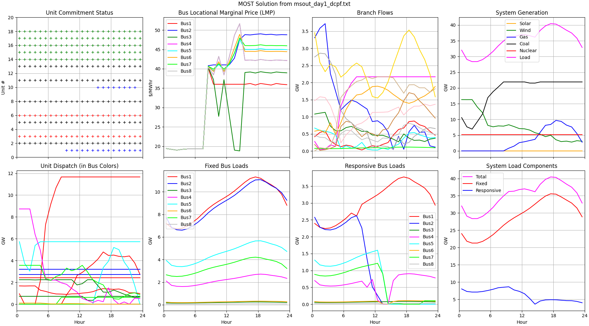
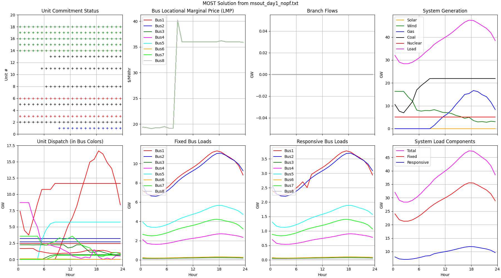
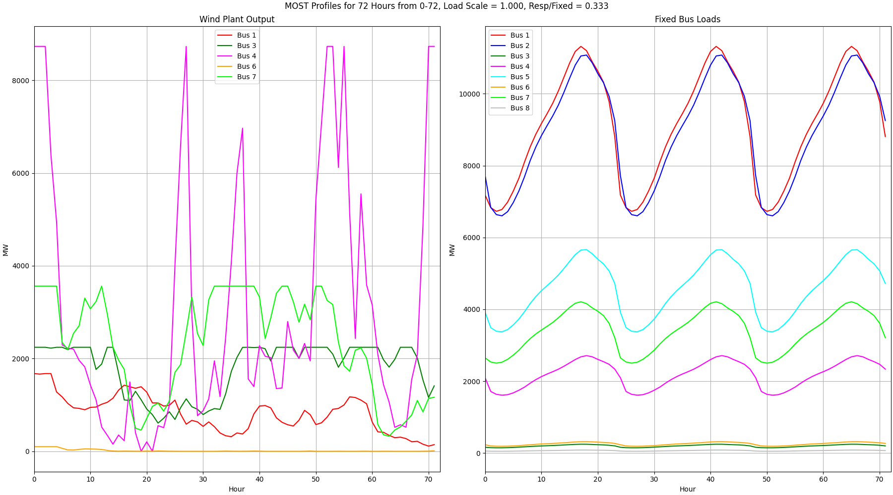
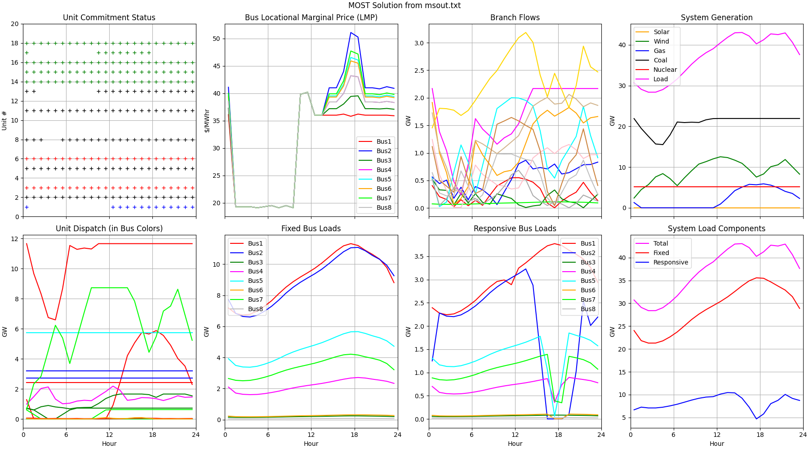
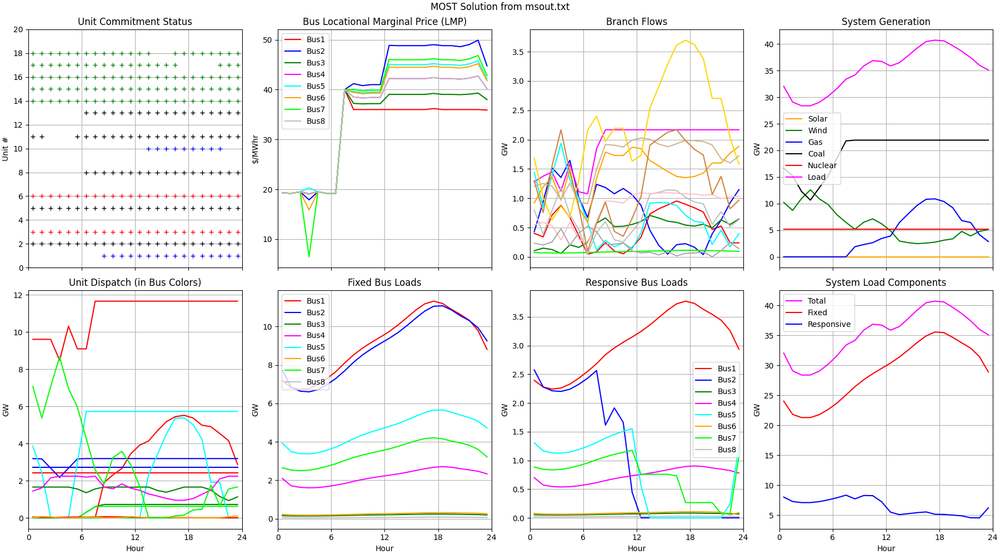
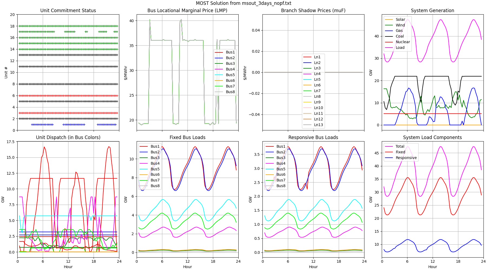
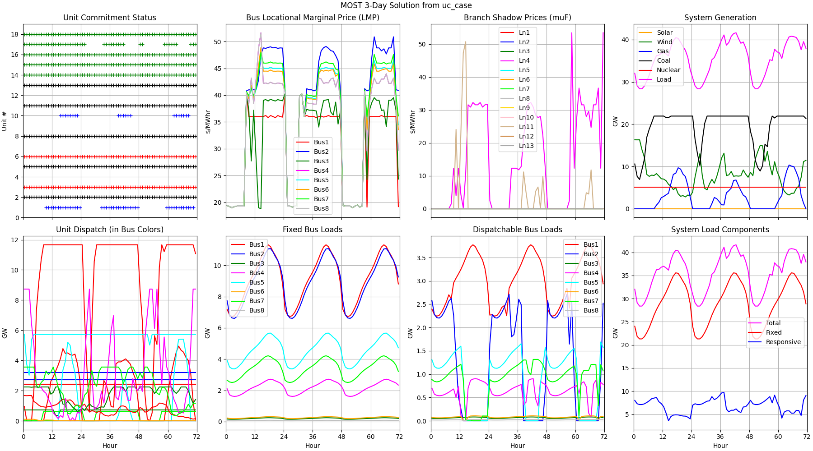
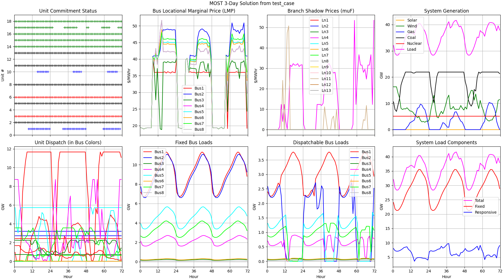

# ERCOT 8-Bus Test System for i2x 

This repository contains MATPOWER and Python scripts for an
8-bus ERCOT test system with 5 equivalent wind plants. References: 
 
- [Test System Description](https://doi.org/10.1016/j.apenergy.2020.115182).

- [Synthetic Wind Output Methodology](https://doi.org/10.1109/TPWRS.2009.2033277).

Testing has been done with MATPOWER/MOST 7.1, Octave 8.2.0, and Python 3.10.5. See *requirements.txt* for
the required Python packages and versions.

## Directory of Script and Data Files

- **\_\_init\_\_.py** allows the use of *mpow\_utilities.py* as a module from the parent directory
- **cat\_most.py** concatenates saved MOST solutions from the *msout.txt* format to numpy arrays, saved in *txt* files for *plot\_mday.py*
- **clean.bat** removes output and temporary files from executing scripts
- **miqps\_glpk.m** edited source file for MOST 1.1 / MATPOWER 7.1
- **most\_mday.py** scripted solution of linked 24-hour unit commitment problems, for a sequence of days, in MOST
- **mpow\_utilities.py** functions to load input and output from MATPOWER/MOST into Python dictionaries
- **msout\_3days\_dcpf.txt** a saved MOST solution for 3 days, network model included
- **msout\_3days\_nopf.txt** a saved MOST solution for 3 days, network model excluded
- **msout\_day1\_dcpf.txt** a saved MOST solution for day 1, network model included
- **msout\_day1\_nopf.txt** a saved MOST solution for day 1, network model excluded
- **msout\_day2\_dcpf.txt** a saved MOST solution for day 2, network model included
- **msout\_day3\_dcpf.txt** a saved MOST solution for day 3, network model included
- **plot\_mday.py** plots the data created from *most\_mday.py*
- **plot\_most.py** plots the data from *msout.txt* or another MOST solution file specified on the command line
- **prep\_most\_profiles.py** creates load and wind profiles for MOST in *test\_resp.m*, *test\_unresp.m*, and *test\_wind.m*. Requires *wind\_plants.dat*.
- **requirements.txt** lists the required Python packages for scripts in this repository, e.g., use with *pip install -r requirements.txt*
- **test\_case.m** defines the 8-bus system model buses, branches, and generators
- **test\_resp.m** defines responsive load variation by hour, also called dispatchable load. Overwritten by *prep\_most\_profiles.m*
- **test\_solve.m** script that solves an example in MOST. Tested with Octave.
- **test\_unresp.m** defines unresponsive load variation by hour, also called fixed load. Overwritten by *prep\_most\_profiles.m*
- **test\_wind.m** defines wind plant output variation by hour. Overwritten by *prep\_most\_profiles.m*
- **test\_xgd.m** supplemental parameters for MOST example.
- **test\_wind.py** tests the capacity factor, coefficient of variation, autocorrelation coefficient, and probability density function for synthetic wind
- **uc\_case\_Pd.txt** saved bus demand from a 3-day sequence of MOST solutions. Overwritten by *most\_mday.py*
- **uc\_case\_Pf.txt** saved branch flows from a 3-day sequence of MOST solutions. Overwritten by *most\_mday.py*
- **uc\_case\_Pg.txt** saved generation outputs from a 3-day sequence of MOST solutions. Overwritten by *most\_mday.py*
- **uc\_case\_lamP.txt** saved bus shadow prices (locational marginal prices) from a 3-day sequence of MOST solutions. Overwritten by *most\_mday.py*
- **uc\_case\_muF.txt** saved branch shadow prices from a 3-day sequence of MOST solutions. Overwritten by *most\_mday.py*
- **uc\_case\_u.txt** saved generation on/off states from a 3-day sequence of MOST solutions. Overwritten by *most\_mday.py*
- **wind\_plants.dat** contains three days of hourly wind output for MOST. Overwritten by *wind\_plants.py*.
- **wind\_plants.py** creates hourly output data in *wind\_plants.dat* for the 5 wind plants of different sizes

## Synthetic Wind Plant Results

Figure 1 shows a snapshot of three days hourly wind plant output for use 
in MOST. The system-level capacity factor (CF) in this three-day window 
is 0.4979 on a total capacity of 16309.30 MW, with a coefficient of 
variation (COV)=0.3803. Figure 2 shows a full year of hourly output from 
the largest wind plant, using the same seed value for randomization. The 
CF over the whole year is less than for the three-day window in Figure 1. 
Wind plant output varies, but is correlated with recent values in the time 
series of output values. Wind plant output is also limited by the cut-in 
and cut-out speeds of the wind turbine, and the nature of its power curve. 
In Figure 2, the autocorrelation coefficient (ACC), partial 
autocorrelation coefficient (PACC), and bi-modal probability density 
function all reflect this expected behavior. 

*Figure 1: Three days of synthetic wind output for the MOST base case, seed=150*

*Figure 2: Annual output for the largest wind plant, seed=150*

## Changes to MOST for Octave and GLPK

The MOST file *miqps\_glpk.m* has been modified so that MOST handles the iteration limit
for GLPK. See Line 10 of *test\_solve.m* for an example. When the iteration limit is
reached, the solution is sub-optimal and locational marginal prices (LMP) are not calculated.
However, the output may still be useful for debugging the case. Summarizing the edits:

- Lines 235-239: copy a few non-error GLPK return codes from https://docs.octave.org/interpreter/Linear-Programming.html
- Line 246: allow the GLPK *msglev* parameter to be specified independently of MATPOWER's *verbose*
- Lines 336-344: issue warnings if the iteration limit, time limit, or MIP gap tolerance is exceeded. Only the iteration limit seems useful at this time; the others either don't stop GLPK, or interfere with interpretation of the sub-optimal solution.

To use these changes, copy *miqps\_glpk.m* into the MATPOWER installation directory,
e.g., *c:\\matpower7.1\\mp-opt-model\\lib*. Alternatively, a solver other than GLPK
may perform better on the following examples. Without an iteration limit, the 3-day unit 
commitment example does not solve within 24 hours. The 1-day example solves without
an iteration limit, but the optimal objective function value has been reached within
20 iterations, within 5 significant digits.

## 1-day Unit Commitment Example

Figure 3 shows the result of a MOST solution of the unit commitment and 
economic dispatch problem, incorporating network losses and constraints 
with a DC power flow. There is no forecasting error in this example, so 
the results are optimistic. Figure 4 shows a MOST solution with network 
losses and constraints ignored, i.e., with no power flow analysis and no 
differentiation between bus LMPs. However, the no-powerflow solution runs
faster and can sometimes provide useful information.

*Figure 3: Results of day-one unit commitment example in MOST, DC network power flow, f=7.20328e6, Time=5.50s*

*Figure 4: Results of day-one unit commitment example in MOST, no network power flow, f=6.39348e6, Time=4.62s*

## 3-day Unit Commitment Example: Separate Days

Figure 5 shows wind plant output and bus load variation over 3 days. MOST 
had some difficulty solving this as a 3-day unit commitment problem using 
GLPK. It may work better with a commercial solver, as suggested in the 
MATPOWER manual. Here, it is solved as a sequence of three 24-hour 
problems, which run much faster. Steps to run this example, assuming that 
*wind\_plants.dat* exists from the earlier section.  

- Run *python prep\_most\_profiles.py 0 24* to create the 24-hour load and wind profiles for day 1, beginning at hour 0.
- Start Octave (or MATLAB), then change to this directory.
- From the Octave command-line, run *test\_solve*.
- When Octave finishes, run *python plot\_most.py*; results are the same as in Figure 3.
- Run *python prep\_most\_profiles.py 24 24* to create the 24-hour load and wind profiles for day 2, beginning at hour 24.
- From the Octave command-line, run *test\_solve*.
- When Octave finishes, run *python plot\_most.py* to create Figure 6. Compared to Figure 3, the total cost (objective function) and average LMPs are lower, while the responsive and total load served are higher, because the wind output is higher during day two.
- Run *python prep\_most\_profiles.py 48 24* to create the 24-hour load and wind profiles for day 3, beginning at hour 48.
- From the Octave command-line, run *test\_solve*.
- When Octave finishes, run *python plot\_most.py* to create Figure 7. Compared to Figure 6, wind power is curtailed for a longer time on day 3, so the total cost is higher and the time of high LMPs is longer.

*Figure 5: Three-days of wind and load variation for MOST example*

*Figure 6: Results of day-two unit commitment example in MOST, DC network power flow, f=5.77992e6, Time=6.15s*

*Figure 7: Results of day-three unit commitment example in MOST, DC network power flow, f=6.28228e6, Time=5.07s*

To simulate three days in a single MOST problem:

- Run *python prep\_most\_profiles.py 0 72* to create the 72-hour load and wind profiles.
- From the Octave command-line, run *test\_solve*. This takes several minutes to solve with a DC optimal power flow.
- When Octave finishes, run *python plot\_most.py* to generate Figure 8.
- At line 8 of *test\_solve.m*, change *most.dc\_model* from 0 to 1.
- From the Octave command-line, run *test\_solve*. This takes about 30 seconds to solve with no network model.
- When Octave finishes, run *python plot\_most.py* to generate Figure 9.

For certain choices of parameter, e.g., the generator minimum up time, 
minimum down time, and reserve quantities, the three-day problem doesn't 
solve in MOST at all. It's faster to solve the three-day problem in
separate one-day problems, concatenating the results.

*Figure 8: Results of three-day unit commitment example in MOST, DC network power flow, f=1.92671e7, Time=1294.87s*

*Figure 9: Results of three-day unit commitment example in MOST, no network power flow, f=1.73367e7, Time=36.18s*

## 3-day Unit Commitment Example: Scripted Solution

Execute the following two commands to produce Figure 10. In this plot, branches with
positive shadow prices have reached their capacity for some period, which indicates
congestion.

- Run *python most\_mday.py*
- Run *python plot\_mday.py*

*Figure 10: Sequence of scripted 1-day solutions in MOST, f=1.9265e7, Time=16.69s*

For comparison, Figure 11 plots the solutions from Figures 3, 6, and 7 on the same
graph. To reproduce this plot:

- Run *python cat\_most.py*
- Run *python plot\_mday.py test\_case*

*Figure 11: Sequence of concatenated 1-day solutions in MOST, f=1.9265e7, Time=16.72s*

The results in Figures 10 and 11 match. However, the three-day solution 
from Figure 8 differs slightly, and it takes nearly 80 times longer to 
solve. Figure 3-9 and Table 6-7 of the MOST manual indicate why this may 
happen, as the problem complexity multiplies by the number of time periods 
in the planning horizon, *nt*. In this example, we have one scenario, 
*nj*, and no contingencies, *nc*, so they don't influence the 
computational complexity.  

## Simulating Branch Upgrades and Contingencies

The summary of branch data and base-case muF follows. Each 345-kV line
is rated for 1086 MVA, so each of these branches represents a transmission
corridor of 2-6 lines in parallel. The corridor from bus 1 to bus 2 has
a positive muF, so it could be increased from 2 lines in parallel to 3
in parallel. The same reasoning applies to line 11, from bus 3 to bus 4.
To implement these grid upgrades, we should multiply the line ratings
(*RATE\_A*, *RATE\_B*, *RATE\_C*) and line charging (*Bpu*) by **1.5**, then
divide the branch impedance (*Rpu*, *Xpu*) by **1.5**. If any of these branches
happened to be transformers, their *TAP* and *SHIFT* parameters would be
unchanged. 

    Branch Summary
    Idx Frm  To  Rating  PkFlow Avg muF        Rpu       Xpu      Bpu
      1   5   6  2168.0   960.0    0.00  0.0042376 0.0358982  2.48325
      2   4   5  6504.0  4169.2    0.00  0.0024809 0.0210167 13.08450
      3   4   6  2168.0  1662.3    0.00  0.0059792 0.0506525  3.50388
      4   1   2  2168.0  2168.0   15.29  0.0061586 0.0521727  3.60905
      5   2   7  2168.0   919.9    0.00  0.0062152 0.0526516  3.64217
      6   1   5  2168.0  1892.7    0.00  0.0058505 0.0495622  3.42847
      7   4   8  2168.0   113.0    0.00  0.0063891 0.0541249  3.74409
      8   6   7  2168.0  1230.9    0.00  0.0059465 0.0503755  3.48473
      9   2   5  6504.0  3819.0    0.00  0.0014728 0.0124769  7.76783
     10   1   4  2168.0  1795.5    0.00  0.0078791 0.0667473  4.61724
     11   3   4  2168.0  2168.0    2.84  0.0043923 0.0372097  2.57398
     12   5   7  2168.0  2168.0    0.00  0.0049678 0.0420845  2.91120
     13   1   3  3252.0  3051.9    0.00  0.0042162 0.0357173  5.55918

To reduce the number of parallel lines, the scaling factor would be less than 1.
For example, scale by **0.8333** to change branch 9, between buses 2 and 5, from
6 lines in parallel to 5 lines in parallel. To remove a branch completely, the
scaling factor would be **0.0**, to be implemented by setting *BR\_STATUS* to 0.

Copyright 2022-2023, Battelle Memorial Institute

