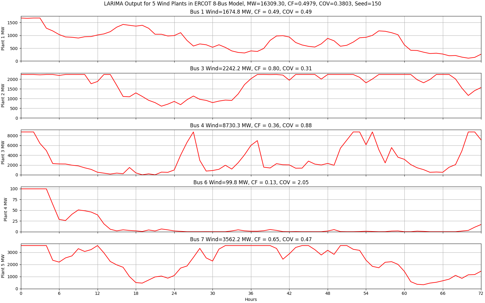

# ERCOT 8-Bus Test System for i2x 

This repository contains Matpower and Python scripts for an
8-bus ERCOT test system with 5 equivalent wind plants.  References: 
 
- [Test System Description](https://doi.org/10.1016/j.apenergy.2020.115182).

- [Synthetic Wind Output Methodology](https://doi.org/10.1109/TPWRS.2009.2033277).

## Directory of Script and Data Files

- **test\_wind.py** tests the capacity factor, coefficient of variation, autocorrelation coefficient, and probability density function for synthetic wind
- **wind\_plants.dat** contains three days of hourly wind output for MOST
- **wind\_plants.py** creates hourly output data in *wind\_plants.dat* for the 5 wind plants of different sizes

## Synthetic Wind Plant Results

Figure 1 shows a snapshot of three days hourly wind plant output for use 
in MOST.  The system-level capacity factor (CF) in this three-day window 
is 0.4873 on a total capacity of 16291.50 MW, with a coefficient of 
variation (COV)=0.4366.  Figure 2 shows a full year of hourly output from 
the largest wind plant, using the same seed value for randomization.  The 
CF over the whole year is less than for the three-day window in Figure 1.  
Wind plant output varies, but is correlated with recent values in the time 
series of output values.  Wind plant output is also limited by the cut-in 
and cut-out speeds of the wind turbine, and the nature of its power curve.  
In Figure 2, the autocorrelation coefficient (ACC), partial 
autocorrelation coefficient (PACC), and bi-modal probability density 
function all reflect this expected behavior.  

*Figure 1: Three days of synthetic wind output for the MOST base case, seed=150*

*Figure 2: Annual output for the largest wind plant, seed=150*

Copyright 2022-2023, Battelle Memorial Institute

