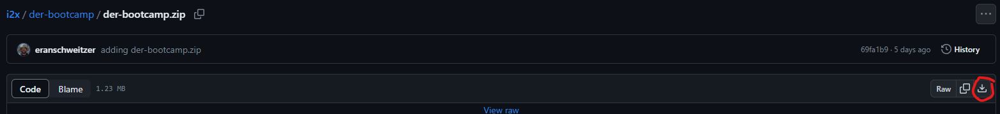

# DER Bootcamp
This folder contains materials for the the DER Bootcamp on October 23rd, 2023 taking place as part of GridTech Connect in Newport Rhode Island.

## Installation/Setup Instructions
> **Note:** Due to some of the software tools we'll be using, chiefly OpenDSS via the [py-dss-interface](https://py-dss-interface.readthedocs.io/en/latest/) only the Windows operating system is full supported.

To make sure and avoid any conflicts, it is **strongly** recommended that a dedicated environment be created for the purposes of this bootcamp and its exercises.
### Step 1: Environment Manager
We recommend using [Miniconda](https://docs.conda.io/projects/miniconda/en/latest/) as an environment manager.
If Miniconda (or Anaconda) is not already installed on your machine:
1. Go to https://docs.conda.io/projects/miniconda/en/latest/
2. Select the latest version
3. Run the installer (sticking with the default options is just fine.)

It is _not_ recommended to add miniconda to your PATH.

### Step 2: Setup the environment
1. Start either the "Anaconda Prompt (miniconda3)" or "Anaconda Powershell Prompt (miniconda3)", based on terminal preference.
    *Click on the Windows-Start menu and search for one of these
2. create a new environment via `conda create --name der-bootcamp python=3.10`
    * When asked to proceed, entry `y` and click `Enter`
3. Activate the new environment: `conda activate der-bootcamp`
    * After this you should see `(der-bootcamp)` at the start of the command line. 
4. Install the i2x package via [pip](https://pypi.org/project/pip/) `pip install i2x`
    * _Note_: This might take a couple minutes. When it's done the `(der-bootcamp) >` at the start of the line will reappear.
5. We'll need a few other packages for running the [jupyter notebooks](https://jupyter.org/) with the exercises. Run the command `conda install jupyter notebook nbformat chardet cchardet`
    * When asked to proceed, entry `y` and click `Enter` 
### Step 3: Run the excersizes
1. Download the [der-bootcamp.zip](./der-bootcamp.zip) file and unpack it.
    * To download click the link above and then click on the download arrow on the right side of the screen:
    
2. Start either the "Anaconda Prompt (miniconda3)" or "Anaconda Powershell Prompt (miniconda3)", based on terminal preference.
3. Activate the der-bootcamp environment: `conda activate der-bootcamp`
4. Navigate to the location of the unpacked der-bootcamp folder using the `cd` command.
5. Start the jupyter notebook via `jupyter notebook`

The last step will open a web browser tab showing the file tree of the der-bootcamp folder.
All activities and materials are in this folder.
The activities are jupyter notebooks and end with `.ipynb`.

To start an activity simply click on the jupyter notebook in the file tree.

Try out the [getting_started](./getting_started.ipynb) notebook to see that everything is running properly.

## Current status of .zip file to download
This table links to the most recent zip file with the bootcamp materials, along with latest update and status note.

| zip file link| last updated | status |
|:------------ | :---------- | :----- |
|[der-bootcamp.zip](./der-bootcamp.zip) | Oct. 18, 2023 | In development, good for environment testing, not final|

