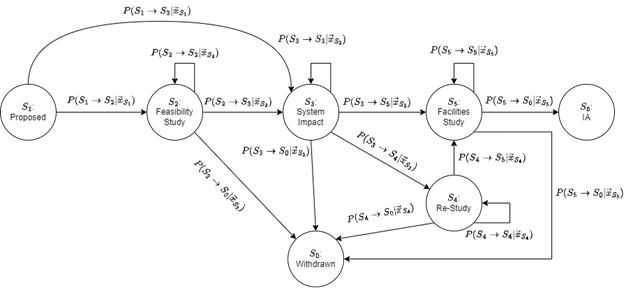
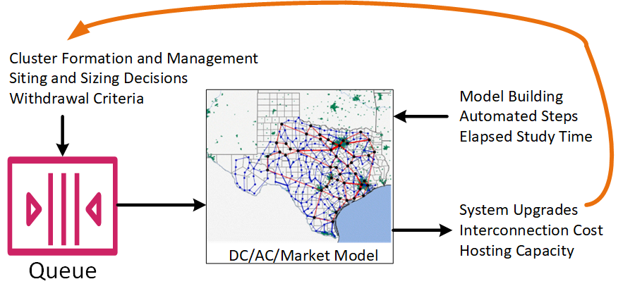
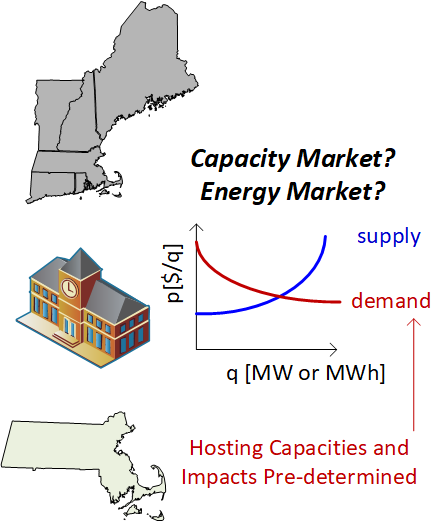

Sprint Studies for the i2x Roadmap
==================================

The Interconnection Innovation e-Xchange (i2X) is a partnership platform 
to bring together diverse stakeholders involved in the interconnection of 
solar and wind energy resources to the electric grid.  i2X is a program of 
the U.S.  Department of Energy's (DOE) Solar Energy Technologies Office 
(SETO) and Wind Energy Technologies Office (WETO), funded under the 
Bipartisan Infrastructure Law (BIL).  Pacific Northwest National Lab 
(PNNL), National Renewable Energy Lab (NREL), and Lawrence Berkeley 
National Lab (LBNL) support SETO and WETO in i2X.  

To address increasingly pervasive climate concerns and achieve deep 
decarbonization in alignment with the Biden Administration's 2035 
decarbonization goals, the electric grid is transforming rapidly, with 
interconnection processes for solar and wind resources becoming more 
complex as penetration levels increase.  Throughout the United States, 
queue times to interconnect solar and wind have been rising, jeopardizing 
ambitious state-level decarbonization goals.  i2X will develop innovative 
solutions and provide technical assistance to enable faster, simpler, and 
fairer interconnection of solar energy, wind energy, and energy storage 
resources while ensuring the electric grid reliability and resilience.  

i2X will publish a roadmap incorporating analytics from two sprint 
studies, augmented by learnings from the technical assistance projects.  
Each sprint study will be tightly scoped, with feedback from the i2X 
community, to be completed in six to nine months.  The first sprint study 
will focus on a better queue.  Some of the ideas include better 
automation, clustered impact studies, and sharing of grid upgrade costs.  
The second sprint study will focus on queue alternatives, for example, an 
auction-based process of hosting capacity or grid needs, informed by 
experience with auctions of broadband spectrum.  There may be 
cross-cutting improvements to achieve more equitable outcomes, not just 
more economically efficient outcomes.  The metrics and simulation tools 
will support analysis of both equity and economic outcomes.  

The proposed sprint study design intends to first establish a baseline 
model of the first-come, first-served interconnection queue process, and 
then measure changes against this baseline of proposed improvements and 
alternatives to the queue.  Some of these improvements include: increased 
access to information prior to entering the queue; mechanism to study 
interconnection requests in groups (i.e., clusters); increased financial 
commitments; increased readiness requirements; availability of optional 
informational interconnection studies outside of the queue process.  The 
baseline transmission and distribution system interconnection queue models 
proposed for this effort are described in the figures below.  
 
State Machine Models
--------------------

BES Interconnections
^^^^^^^^^^^^^^^^^^^^

Figure 1 captures the key states within the interconnection queue, with 
the probability of movement between states determined by a set of 
dependent parameters, (x_i ) ?, described below.  

|StateDiagram1|

*Figure 1: State diagram for the transmission system interconnection queue process*

0. Optional Informational Study 
1. Conditional Parameters for Transitions out of S1: Proposed. 

   a. Readiness 

      - Permitting requirements/status
      - Site control
      - Commercial readiness
      - Land use restrictions
      - Application fees paid

   b. Project jurisdiction
   c. Scoping Meeting 
   d. Feasibility Study

*Outcomes: Application Validation/Acceptance/Approval of Negligible Impact Interconnections*

2. Conditional Parameters for Transitions out of S2: Feasibility Study 

   a. Strictly Time Dependent 

      - Current simulation time 
      - Time of submission to study 

   b. Interconnection Queue Specific 

      - Violation/cost estimates 
      - Project size 
      - Project location
      - Project complexity
      - Withdrawal penalties 

   c. Accumulators 

      - Project budget
      - Fees spent 
      - Time spent [person-hours]

*Outcomes: Estimated system upgrades, costs, and implementation timeline* 

3. Conditional Parameters for Transition out of S3: System Impact 

   a. Strictly Time Dependent 

      - Current simulation time 
      - Time of submission to study 
      - Cluster window, if applicable (annual, semi-annual, etc.) 

   b. Interconnection Queue Specific 

      - Cluster vs individual

         - Type of cluster (geographic, electric, etc.) 
         - Number of projects in cluster
         - Capacity of cluster

      - Project size 
      - Project location
      - Project complexity
      - Cost allocation estimate (and/or difference to estimate from feasibility study/informational study) 
      - Withdrawal in lower (or equal in case of clusters) queue positions (triggering re-study) 
      - Withdrawal penalties 

   c. Accumulators

      - Project budget
      - Fees spent 
      - Time spent [person-hours]
 
*Outcomes: identifies system upgrades (as needed), refined estimate of 
cost & implementation timeline, notification of necessary re-study* 

4. Conditional Parameters for Transition out of S4: Re-Study. This state should be identical to S3 in terms of its dependencies with the following exceptions 

   a. No cluster window 
   b. Limit on number of re-studies 
   c. No further withdrawals 
   d. Includes affected system studies 

5. Conditional Parameters for Transition out of S5: Facilities Study 

   a. Strictly Time Dependent 

      - Current simulation time 
      - Time of submission to study 

   b. Interconnection Queue Specific 

      - Difference in cost estimation of System Impact and Re-Study
      - Project size 
      - Project location
      - Project complexity 
      - Withdrawal penalties 

   c. Accumulators 

      - Project budget
      - Fees spent 
      - Time spent [person-hours]

*Outcomes: cost for facilities and upgrades (engineering, equipment, 
procurement, and construction), detailed estimates of time to procure, 
construct, and install upgrades.* 

The players that can influence these probabilistic parameters include: the 
interconnection applicant; other interconnection applicants ahead in the 
queue (first-come, first-serve); other interconnection applicants within 
the queue (cluster); electric service provider; regulator.  Outside 
influences on these parameters include: access to information prior to 
entering the queue, such as hosting capacity maps; current queue status; 
estimated upgrade costs, including the cost allocation protocol for 
clusters; and optional information study.  

DER Interconnections
^^^^^^^^^^^^^^^^^^^^

Figure 2 captures the key states within the distribution system 
interconnection queue, based on the NY PUC Standardized Interconnection 
Requirements and Application Process, with the probability of movement 
between states determined by a set of dependent parameters, (x_i ) ?, 
described below.  

|StateDiagram2|

*Figure 2: State diagram for the distribution system interconnection queue process*

0. Inquiry and Inquiry Review

   a. Optional request for pre-application report

1. Conditional Parameters for Transitions out of S1: Proposed. 

   a. Readiness 

      - Permitting requirements/status
      - Site control
      - Land use restrictions
      - Application fees paid

   b. Strictly Time Dependent

      - Time of submission to review
  
   c. Interconnection Queue Specific

      - Completeness of Application 
      - Project size
      - Project location
      - Project complexity
      - Scoping Meeting 

   d. Accumulators

      - Project budget
      - Fees spent
      - Time spent [person-hours]

*Outcomes: Notification of Acceptance, notice of plans to witness 
test/verification process, cost estimate for interconnection 
facilities/distribution upgrades*

2. Conditional Parameters for Transitions out of S2: Preliminary Screening Analysis 

   a. Strictly Time Dependent

      - Time of submission to review

   b. Interconnection Queue Specific

      - Project size
      - Project location
      - Project complexity
      - Passes Technical Screens
      - Elect Preliminary Screening Analysis Results Meeting
      - Elect Supplemental Screening Analysis
      - Elect Full CESIR (Coordinated Electric System Interconnection Review)
      - Cost allocation estimate

   c. Accumulators

      - Project budget
      - Fees spent
      - Time spent [person-hours]

*Outcomes: Interconnection Acceptance or Notice of failure to pass 
technical screens, cost allocation estimate for interconnection 
facilities/distribution upgrades or cost estimate for CESIR* 

3. Conditional Parameters for Transitions out of S3: Supplementary Screening Analysis 

   a. Strictly Time Dependent

      - Time of submission to review

   b. Interconnection Queue Specific

      - Project size
      - Project location
      - Project complexity
      - Elect Supplementary Screening Analysis Meeting
      - Elect Full CESIR

   c. Accumulators

      - Project budget
      - Fees Spent
      - Time spent [person-hours]

*Outcomes: Interconnection Acceptance or Notice of failure to pass 
technical screens, cost estimate for interconnection 
facilities/distribution upgrades or cost estimate for CESIR* 

4. Conditional Parameters for Transitions out of S4: CESIR

   a. Strictly Time Dependent

      - Time of submission to review

   b. Interconnection Queue Specific

      - Project size
      - Project location
      - Project complexity
      - Updated interconnection design package, if necessary
      - Requested electrical studies/three-line diagram

   c. Accumulators

      - Project budget
      - Fees spent
      - Time spent [person-hours]

*Outcomes: Utility system impacts review, system compliance review, cost 
estimate for interconnection facilities/distribution upgrades, qualifying 
upgrade disclosure*

Ideas from Project Plan and Engagements
---------------------------------------

Identify at least two different improvements to the current queue-based 
DER interconnection process that could provide measurable improvement.  
These may include: 

  - Incremental queue enhancements, e.g., clustering, tool automation, shared cost of circuit upgrades. 
  - Queue replacements, e.g., a proactive auction-based process to fill hosting capacity and/or grid needs. 
  - Soft improvements, such as providing education about the interconnection process for targeted groups. 
  - New tools, such as a "PVWatts for grid connections."
  - Adoption of modern standards like IEEE 1547-2018 and IEEE 2800-2022, which could lead to regularization of processes between states and to new technical design practices. 
  - Separate process improvement for more equitable outcomes, not just more economically efficient outcomes. The metrics and simulation tools will support analysis of both equity and economic outcomes.

Develop scoping plans for sprint studies that will analyze and compare the 
process improvement proposals.  Obtain scope approval from DOE, with input 
from the Technical Advisory Group.  Recruit stakeholder participation.  
Perform the sprint study using open-source tools and data sources.  Follow 
procedures to maintain data privacy and business confidentiality.  
Preserve the data, tools, and analysis on the i2X web site, as 
nondisclosure agreements and privacy issues allow.  

Compare empirical results from simulated processes with voluntary 
participation by utilities and DER applicants.  The simulated process may 
run in parallel with the actual process.  Identify participants, data 
sources, targeted stakeholder sectors, and states to participate in these 
experiments.  Interview participants about how they made their decisions 
to approve or disapprove an application, to withdraw an application from 
the queue, etc.  Publicly available test systems may be used in this work.  

Define a public system with electric power grids (as realistic as possible 
to existing), and configurable DER application queues.  The cost and 
schedule metrics may define specific components to be included, e.g., 
impact study costs, network upgrade costs, and certain commissioning 
delays.  New tools may simulate the results of a baseline queue management 
based on current queue-based DER interconnection process and the two 
future queue management options, over a ten-year period.  The baseline and 
options may be compared based on i2X metrics.  Monte Carlo and Pareto 
methods may be applied to account for uncertainties, trade-offs, and 
minimum regret goals.  

Queue-Based Mechanism
^^^^^^^^^^^^^^^^^^^^^

The analytical evaluation of queue management options would use
a state-machine model of the Queue, as discussed earlier, in conjunction
with a grid model to simulate location-dependent hosting capacities and
grid upgrade costs.

  - Assume clusters per NOPR
  - Incorporate new equity metrics
  - Shared costs of system upgrades
  - When is a project ready to proceed?
  - Site control and power purchase agreement
  - Payments to stay in queue
  - Project financing in place
  - Cluster formation and management options
  - Model building improvements
  - Tool and re-study automation

|QueueSprint|

*Simulation-based Evaluation of Queue Management Options*

Auction-Based Mechanism
^^^^^^^^^^^^^^^^^^^^^^^

An auction of renewable connection capacity would completely bypass the interconnection queue.
The resource requirements, available locations, and hosting capacities would be pre-determined.
Minimum bid levels could be required to cover any grid upgrade costs

  - Parallels to wideband spectrum auction
  - Relationship between resource procurement processes, often under state jurisdiction, and interconnection processes under FERC jurisdiction
  - Set-asides for communities and underserved populations
  - Incorporate new equity metrics
  - Identifying locations and quantities for new solar and wind resources
  - Investing in renewable energy development zones (transmission)
  - Requirements to participate
  - Bid clearing mechanisms
 
|AuctionSprint|

*Auction-based Alternative to the Queue*
 
Coverage from First Round of Sprint Studies
-------------------------------------------

The following table describes **three** general improvements to the 
queue-based process, one of which is the auction-based alternative.  The 
project plan calls for only **two** improvements in the first round, one 
of which would be the auction-based process.  

.. list-table:: Queue improvements, test systems, and expected outcomes for the first round of sprint studies.
   :widths: 20 40 50
   :header-rows: 1

   * - Improvement
     - System and Scenario
     - Expected Outcomes
   * - Study Automation
     - | WECC: 3-month cluster studies
       | 118: 1-month project studies 
       | 9500: 1-month project studies
       | LVN: 3-month cluster studies 
     - | Reduced cost of studies
       | Reduced time of studies
   * - Shared Upgrades
     - | WECC: Series capacitors
       | 118: Transmission lines 
       | 9500: Inverter functions
       | LVN: Network protectors 
     - Reduced variabilty in grid upgrade cost
   * - Auction of Capacity
     - | WECC: add 30% renewables
       | 118: add 20% renewables 
       | 9500: community-based wind 
       | LVN: community-based solar 
     - | Reduced variability in cost
       | Reduced variability in time
       | Reduced total study costs
       | Reduced grid upgrade costs

Deferrals from the first round of sprint studies:

  - Targeted improvements on the acceptance rate of applications. There will be outputs of acceptance rate, but we don't know the effect ahead of time and have not chosen improvements with a goal of increasing the acceptance rate. This was a relatively new suggestion from DOE in the leadership meeting discussion of metrics for i2X.
  - Energy equity and environmental justice (EEEJ) effects. This depends on the definition and acceptance of EEEJ quantitative metrics.
  - Additional test systems and suggested improvements, which might come from technical assistance (TA), solution exchanges, or sponsor suggestions. These can be added to the sprint study platform in future work.
 

