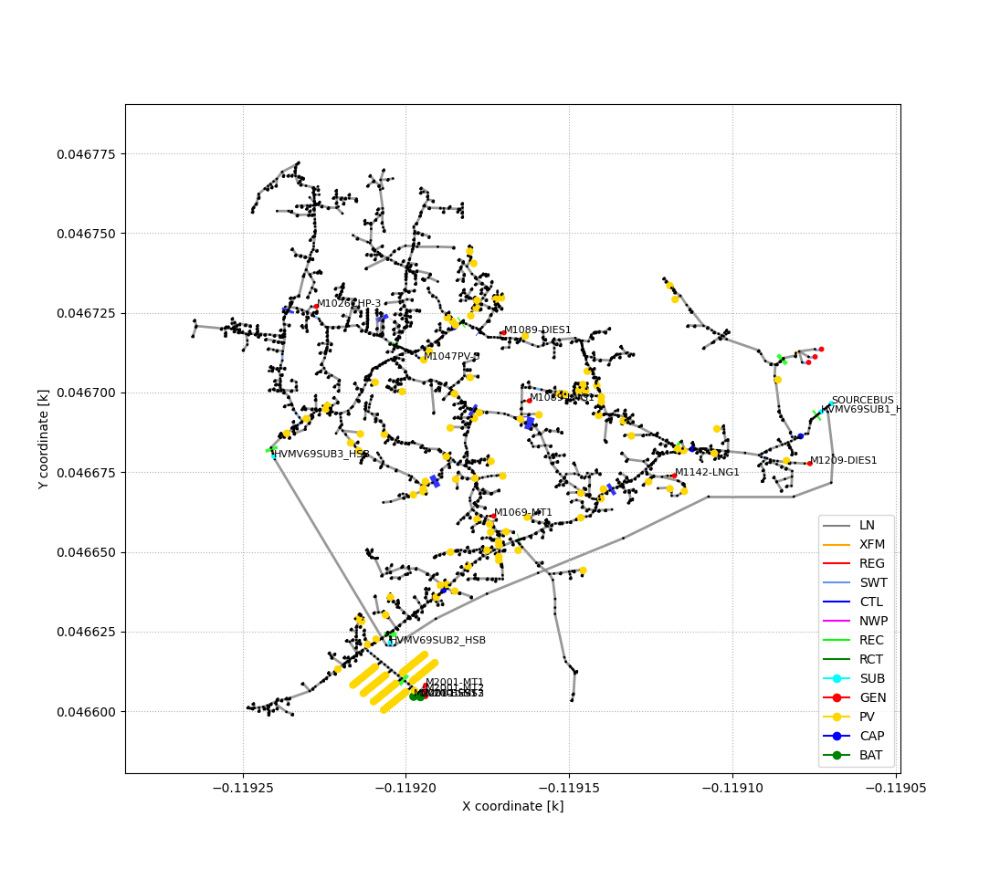
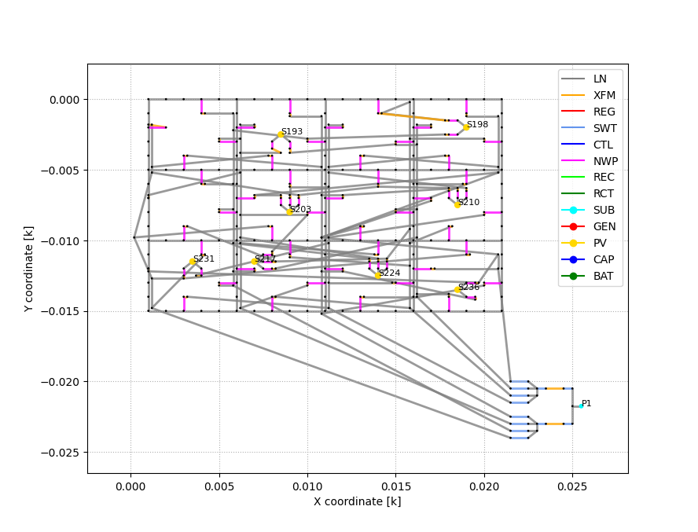

Public Test Systems
===================

Four medium-scale test systems have been developed to support i2x sprint studies and bootcamps.

Bulk Electric System (BES) Test Systems
---------------------------------------

The source data for these BES test systems is maintained at `CIMHub/BES 
<https://github.com/GRIDAPPSD/CIMHub/tree/feature/SETO/BES>`_.  Versions
are available in MATPOWER, the Common Information Model (CIM), and the 
Alternative Transients Program (ATP). All these formats are free to use.

================= ======== ========
Attribute Counts  WECC 240 IEEE 118
================= ======== ========
Buses [#f1]_           243      193
Machines [#f2]_         49       56
Solar                   25       14
Wind                    10        5
Aggregate DER            2        0
Series Capacitors        9        0
================= ======== ========

|WECC240|
*WECC 240-bus Test System for MATPOWER or ATP*
 
|IEEE118| 
*IEEE 118-bus Test System Enhanced with IBR for MATPOWER or ATP*

Distributed Energy Resource (DER) Test Systems
----------------------------------------------

The source data for these DER test systems is maintained at the
`pnnl/i2x github repository <https://github.com/pnnl/i2x/tree/develop>`_. Versions
are available in OpenDSS, CIM, ATP, and GridLAB-D. All these formats are free to use.
 
|IEEE9500| 
*Proposed IEEE 9500-node model with 3 radial feeders, for OpenDSS in i2x-der*
 
|IEEELVN| 
*IEEE North American Low-Voltage Network in i2x-der, for OpenDSS*

.. rubric:: Footnotes

.. [#f1] IEEE 118 model includes extra buses for generator step-up (GSU) transformers. Both models may acquire extra buses for the medium-voltage equivalent collector circuits in IBR plants.
.. [#f2] Reflects aggregation of steam and hydro units.

.. |WECC240| image:: media/WECC240.png
.. |IEEE118| image:: media/IEEE118.png

