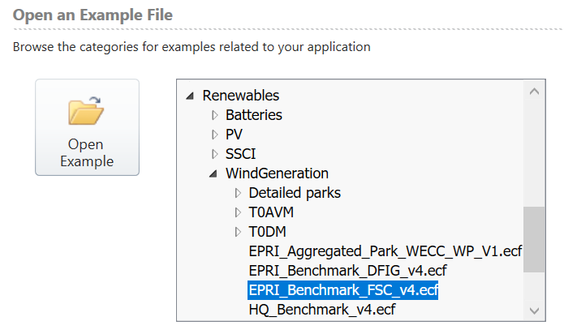

# EMTP Materials for EMT Bootcamps 

This repository contains presentations and examples for the EMTP track of 
the NERC/i2X bootcamps in electromagnetic transient (EMT) modeling of 
inverter-based resources (IBR). 

- [July 27 Training slides](EMTP_training_session_1.pdf)

## Plant-Level Session

In the August 3 session, we will use an example called **EPRI_Benchmark_FSC_v4**,
which comes with EMTP. It includes a 75-MW wind plant, Type IV, connected to
a 4-bus, 120-kV system. You can find this example under the Renewables Toolbox
as shown below:

If you open this case and double-click on the wind park icon, the **Help** tab
provides access to a 61-page PDF manual on the Type IV model features. During
the session, we will exercise various features of the model, and add a COMTRADE
recorder to the system.

More detail on the test system and applications is available in a free report:

- [EPRI Benchmark Report](https://www.epri.com/research/products/3002000347)

Copyright 2022-2023, Battelle Memorial Institute

