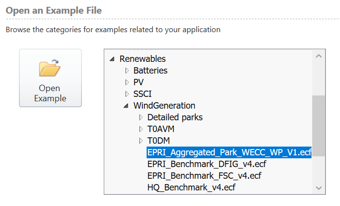

# EMTP Materials for EMT Bootcamps 

This repository contains presentations and examples for the EMTP track of 
the NERC/i2X bootcamps in electromagnetic transient (EMT) modeling of 
inverter-based resources (IBR). 

- [July 27 Training slides](EMTP_training_session_1.pdf)

## Plant-Level Session

In the August 3 session, we will use an example called 
**EPRI\_Aggregated\_Park\_WECC\_WP\_V1** which comes with EMTP.  It 
includes a 75-MW wind plant, Type IV, connected to a 4-bus, 120-kV system.  
You can find this example under the Renewables Toolbox as shown below: 

If you open this case and double-click on the wind park icon, the **Help** tab
provides access to a 23-page PDF manual on the various model features. During
the session, we will exercise various features of the model, and add a COMTRADE
recorder to the system.

More detail on the test system and applications is available in a free report:

- [EPRI Benchmark Report](https://www.epri.com/research/products/3002000347)

Also, there is an older **EPRI\_Benchmark\_FSC\_v4**, example that comes 
with EMTP, two spaces below *EPRI\_Aggregated\_Park\_WECC\_WP\_V1* in the 
screenshot.  This model's help document is longer, at 61 pages, and it
provides additional background information.  

## Directory of EMTP Files

These models and scripts are used in the video walk-throughs:

- **Machine2.ecf**; a project with rotating machine in the plant model test circuit.
- **Wind2.ecf**; a project with IBR in the plant model test circuit.
- **Wind4.ecf**; a plant model test circuit, set up for automated fault simulations.
- **FaultScript.dwj**; a JavaScript program that applies 12 faults to *Wind4.ecf*

Copyright 2022-2023, Battelle Memorial Institute

