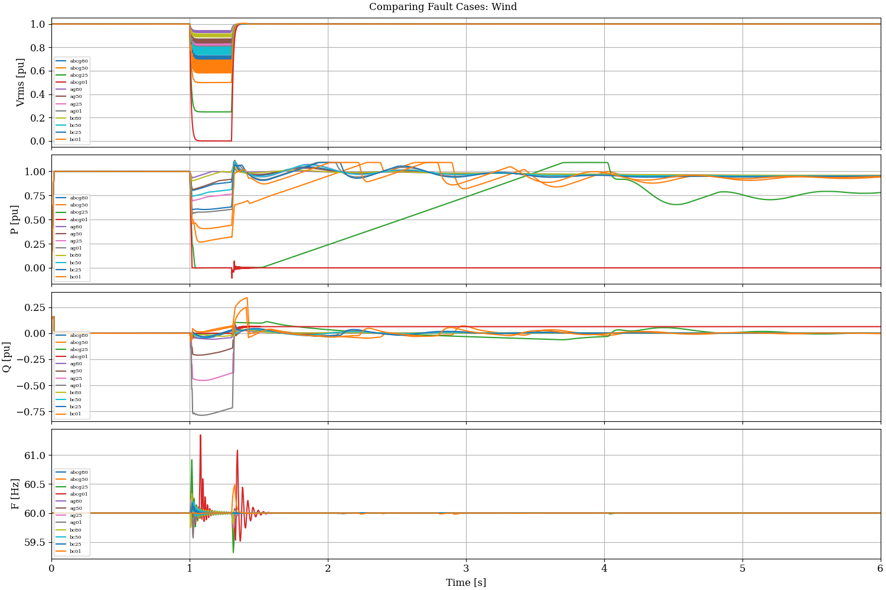
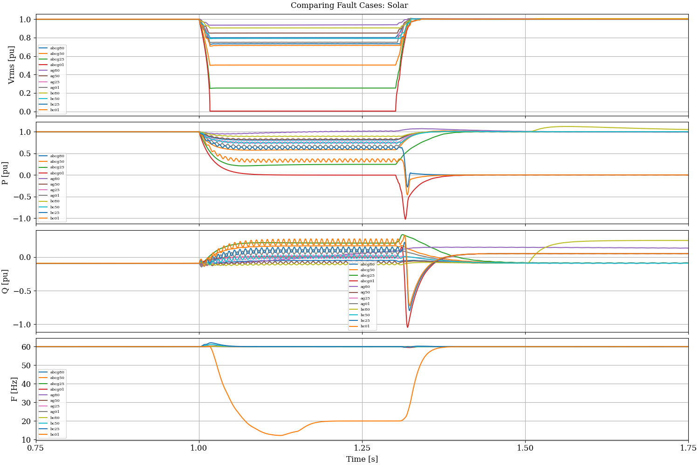

# Python Scripts for EMT Bootcamps 

This repository contains code to plot and post-process data for the 
NERC/i2X bootcamps in electromagnetic transient (EMT) modeling of 
inverter-based resources (IBR).  

## Directory of Python Scripts and Notebooks

These files are used to process EMT simulation results:

- **comtrade.py**; support module that reads COMTRADE files, versions 1991-2013
- **cplot.py**; plots three-phase v(t) and i(t) from COMTRADE
- **cplot.ipynb**; Jupyter Notebook version of *cplot.py*, with additional post-processing examples
- **cplot2.py**; plots IBR and rotating machine results for comparison
- **cplot2.ipynb**; Jupyter Notebook version of *cplot2.py*
- **cplot3.py**; plots average and switching model results for comparison
- **cplot4.py**; plots a set of 12 automated fault simulations
- **notebook.bat**; launches the Jupyter server and a web browser on *cplot.ipynb*
- **notebook2.bat**; launches the Jupyter server and a web browser on *cplot2.ipynb*

## Automated Fault Script Results

These two figures include the results of 12 automated faults in a test circuit
with IBR.

- There are 3 fault types: *ABC-ground*, *A-ground*, and *BC*.
- For each fault type, there are 4 values of fault impedance that produce retained voltages of *80%*, *50%*, *25%*, and *1%* of nominal. (Note: retained voltage may be different for the *BC* faults.)
- The *Wind* results come from *FaultScript.dwj* applied to *Wind4.ecf* in the EMTP directory.
- The *Solar* results come from *FaultScript.py* applied to *Solar4.pswx* in the PSCAD directory.

**Twelve faults applied to a wind plant.**

**Twelve faults applied to a solar plant.**

Copyright 2022-2023, Battelle Memorial Institute

