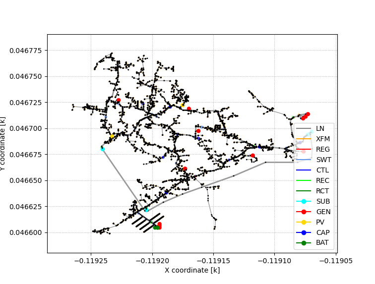

# Hosting Capacity Analysis
## Basic usage
### Step 1: Initialize Object
initialize the hosting capacity object with a configuration file:
```python
import hca as h

inputs = h.load_config("defaults.json")
hca = h.HCA(inputs)
```
### Step 2: Run Baseline Case
The base line case can establish some pre-determined changes to the feeder.
Additionally, the baseline is used when evaluating the hosting capacity metrics.
In the event that the baseline _violates_ any of the limits specified in the input configuration, the limit is changed to being "no worse than the baseline".

```python
hca.runbase()
```

### Step 3: Perform hosting capacity steps
Method `hca_round` performs one "round" of hosting capacity.
In a round:
* A resource type is specified (only `"pv"`` tested presently)
* A location, $n$, is sampled (or specified)
* A capacity, $S_0$, is sampled (or specified)

The following outcomes are possible:
1. No violations with initial capacity $S_0$:
    * A bisection search is performed to find the largest capacity, $S_{lim}$, that doesn't result in violations.
    * A unit with capacity $S_0$ is added at $n$.
    * The hosting capacity is recorded as $S_{lim} - S_0$.
2. Violations occur with initial capacity $S_0$:
    * A bisection search is performed to find the largest capacity, $S_{lim}$, that doesn't result in violations.
    * A unit with capacity $S_{lim}$ is added at $n$.
    * The hosting capacity is recorded as 0.

An HCA round (for a pv unit) is performed via the command:
```python
hca.hca_round("pv")
```
It's also possible to specify either location and/or capacity, for example:
```python
hca.hca_round("pv", bus="n1144663", 
    Sij={"kw":193.5, "kva":241.875})
```
will perform an HCA round at bus `"n1144663"` starting with a capacity of 241.875 kVA.


# Examples
Several examples are available in the [tests](./tests/) folder.
A few notes/caveats are noteworthy upfront:
* By default all non-substation regulators are deactivated in these examples. This is because it was found that their settings were leading to very large $\Delta V$ violations that are not easily remedied by other means.
* There are some voltage and thermal violations in the base 9500 node case, as described in [Step 2 above](#step-2-run-baseline-case) these lead to more relaxed violation limits in practice.
## Thermal Overloads
Run the example via:
```
>python thermal_test.py
```

The script in [`thermal_test.py`](./tests/thermal_test.py) illustrates how thermal overload are identified and remedied.
The program steps through several (3) HCA rounds, adding capacity and calculating hosting capacity.
```
========= HCA Round 1 (pv)=================
Setting bus n1134480 as active bus
Creating new pv resource pv_n1134480_cnt1 with S = {'kw': 726.0, 'kva': 907.5}
[...]
*******Results for bus n1134480 (pv)
Sij = {'kw': 726.0, 'kva': 907.5}
hc = {'kw': 2467.974609375, 'kva': 3084.968261718749}
[...]
========= HCA Round 2 (pv)=================
Setting bus m1069514 as active bus
Creating new pv resource pv_m1069514_cnt2 with S = {'kw': 229.0, 'kva': 286.25}
[...]
*******Results for bus m1069514 (pv)
Sij = {'kw': 229.0, 'kva': 286.25}
hc = {'kw': 2527.9453125, 'kva': 3159.931640625}
[...]
========= HCA Round 3 (pv)=================
Setting bus l3047060 as active bus
Creating new pv resource pv_l3047060_cnt3 with S = {'kw': 392.0, 'kva': 490.0}
[...]
*******Results for bus l3047060 (pv)
Sij = {'kw': 392.0, 'kva': 490.0}
hc = {'kw': 6714.53125, 'kva': 8393.1640625}
```
At each hosting capacity step, the binding metrics are noted.
When the binding metric is thermal, the last step is undone, and a new resource is added in its stead that will exceed the hosting capacity.

```
----------------------------

Resetting HCA round 3 for bus l3047060
Initial cap 392.0 | initial HC  6714.53125 | new cap 7156.53125

----------------------------

========= HCA Round 3 (pv)=================
Setting bus l3047060 as active bus
Specified capacity: {'kw': 7156.53125, 'kva': 8945.6640625}
Creating new pv resource pv_l3047060_cnt3 with S = {'kw': 7156.53125, 'kva': 8945.6640625}
Violations with capacity {'kw': 7156.53125, 'kva': 8945.6640625} (allow_violations is True).
	thermal_emerg
[...]
*******Results for bus l3047060 (pv)
Sij = {'kw': 7156.53125, 'kva': 8945.6640625}
hc = {'kw': 0, 'kva': 0}
[...]
===================================
Violations:
===================================
thermal:
	emerg:
Element
Line.LN6153059-1   -0.721907
Name: %Emerg, dtype: float64
```

The violating line is then upgraded, where we assume a parallel conductor.
```
--------------------- Upgrading -------------------

Upgraded line LN6153059-1 from 225.0 A to 450.0 A

===================================
Upgrades:
===================================
line:
	LN6153059-1:
		2:
			old:225.0
			new:450.0
			length:0.08124714
```

The last HCA round is repeated and shows no violations
```
========= HCA Round 3 (pv)=================
Setting bus l3047060 as active bus
Specified capacity: {'kw': 7156.53125, 'kva': 8945.6640625}
Creating new pv resource pv_l3047060_cnt3 with S = {'kw': 7156.53125, 'kva': 8945.6640625}
No violations with capacity {'kw': 7156.53125, 'kva': 8945.6640625}.
[...]
*******Results for bus l3047060 (pv)
Sij = {'kw': 7156.53125, 'kva': 8945.6640625}
hc = {'kw': 4397.702430725098, 'kva': 5497.1280384063775}
```

### Observations
* The single upgrade resulted in an increase in hosting capacity of over 4 MW.
* The binding violation after upgrade (not shown above, see log files) is $\Delta V$, which indicates that further thermal upgrades would not be useful.

## Addressing $\Delta V$
One of the most common metrics that bind the hosting capacity analysis is a 3% limit on the voltage change, $\Delta V$, at any bus.
As discussed in [the section below](#issue-with-errors) upgrading conductors or transformers is not very effective in addressing this issue.

### Inverter Voltage Control Solution
One solution works is to enable advanced inverter settings.
For example, here is one case with constant power factor control:
```
========= HCA Round 1 (pv)=================
Setting bus n1134480 as active bus
Specified capacity: {'kw': 3250, 'kva': 4062.5}
Creating new pv resource pv_n1134480_cnt1 with S = {'kw': 3250, 'kva': 4062.5}
Violations with capacity {'kw': 3250, 'kva': 4062.5} (allow_violations is True).
	voltage_vdiff
    [...]
	No violations with capacity {'kw': 3194.4580078125, 'kva': 3993.072509765626}. Iterating to find HC
*******Results for bus n1134480 (pv)
Sij = {'kw': 3250, 'kva': 4062.5}
hc = {'kw': 0, 'kva': 0}
```
With `VOLT_VAR-CATA` control, on the other hand:
```
========= HCA Round 1 (pv)=================
Setting bus n1134480 as active bus
Specified capacity: {'kw': 4100, 'kva': 5125.0}
Creating new pv resource pv_n1134480_cnt1 with S = {'kw': 4100, 'kva': 5125.0}
Violations with capacity {'kw': 4100, 'kva': 5125.0} (allow_violations is True).
	voltage_vdiff
[...]
	No violations with capacity {'kw': 4053.955078125, 'kva': 5067.443847656251}. Iterating to find HC
*******Results for bus n1134480 (pv)
Sij = {'kw': 4100, 'kva': 5125.0}
hc = {'kw': 0, 'kva': 0}
```
Notice that the found hosting capacity (line starting with `No violations with capacity...`) is almost 1 MW greater:
| `PF_CONSTANT` | `VOLT_VAR_CATA`|
|:---------------:|:----------------:|
|3194| 4053|


### Regulator Solution
One limited solution is to adjust the substation regulator up, though this option is also limited, since it quickly runs into maximum voltage violations.

When running the example, the `VOLT_VAR_CATA` controls case show this working.
The substation regulator is adjusted slightly up, and the subsequent run has no violations:
```
===================================
Violations:
===================================
voltage:
	vdiff:-0.03307057983944217
Found substation regulator feeder_reg3c
edit regcontrol.feeder_reg3a vreg=124.0
edit regcontrol.feeder_reg3b vreg=124.0
edit regcontrol.feeder_reg3c vreg=124.0
========= HCA Round 1 (pv)=================
Setting bus n1134480 as active bus
Specified capacity: {'kw': 4100, 'kva': 5125.0}
Creating new pv resource pv_n1134480_cnt1 with S = {'kw': 4100, 'kva': 5125.0}
No violations with capacity {'kw': 4100, 'kva': 5125.0}.
[...]
*******Results for bus n1134480 (pv)
Sij = {'kw': 4100, 'kva': 5125.0}
hc = {'kw': 33.0322265625, 'kva': 41.290283203125}
```
Note, however, that the remaining headroom is very low (~33 kW)


In the `PF_CONSTANT` case, the slight increase in regulator set voltage does not resolve the issue and further increases lead to maximum voltage violations.

## Testing/Example
An example/test is available in the `tests` folder, which performs 3 rounds of HCA on the IEEE 9500 Node feeder, and can be run (in the `tests` folder) via:
```
>python ieee9500node_test.py
```

The result should look like this:


_Note_: There are only 2 PV units showing.
That is because the second PV unit selected is very close to the first one, and no hosting capacity was left at that location.

## Issue with $\Delta V$ Errors
There appear to be additions that result in regulator actions or some other control that lead to a sudden large drop in the voltage.

Running:
```
>python ieee9500node_vdiff_test.py
```
Illustrates this issue.

It add a 450 kW PV at bus n1134480.
```python
### add solar to bus n1134480
bus = "n1134480"
Sij = {"kw": 450}
Sij["kva"] = Sij["kw"]/0.8
# run hca round allowing violations (violation should occur)
hca.hca_round("pv", bus=bus, Sij=Sij, allow_violations=True)
```
This generates a voltage difference violation.

The code then upgrades the full path between this node and the source bus, essentially by simulating a doubling of the circuit.
For lines the length is halved and the rating doubled.
For transformers the kVA rating is doubled.

The results however, irrespective of inverter control action are minimal and insignificant (the end of the log generated by the test should look something like this):
```
**** Impact of Inverer Mode and Upgrade ****
Results with inverter mode CONSTANT_PF
pre: -9.428115561680414, post: -9.346122136888917
Results with inverter mode VOLT_WATT
pre: -9.428115561680414, post: -9.346122136888917
Results with inverter mode VOLT_VAR_CATA
pre: -9.428115561680414, post: -9.346122136888917
Results with inverter mode VOLT_VAR_CATB
pre: -9.428115561680414, post: -9.346122136888917
Results with inverter mode VOLT_VAR_AVR
pre: -9.428115561680414, post: -9.346122136888917
Results with inverter mode VOLT_VAR_VOLT_WATT
pre: -9.428115561680414, post: -9.346122136888917
Results with inverter mode VOLT_VAR_14H
pre: -9.428115561680414, post: -9.346122136888917
```

1. The inverter functions make no impact on the $\Delta V$ violation
2. The impact of upgrading the *full* circuit is meaningless compared to the degree of violation.

This seems to suggest that at least with the current tools available in this analysis, a $\Delta V$ violation is basically a "knock-out" criterion.