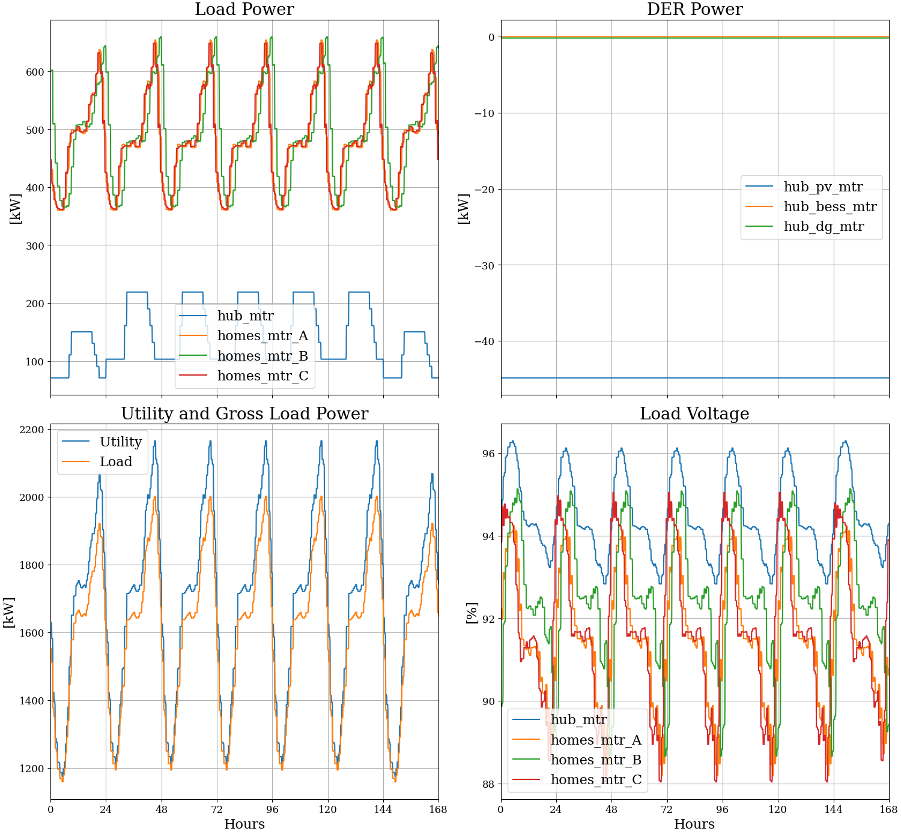
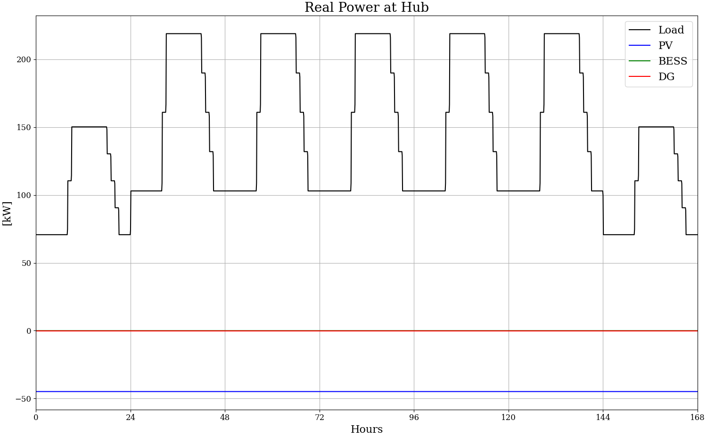
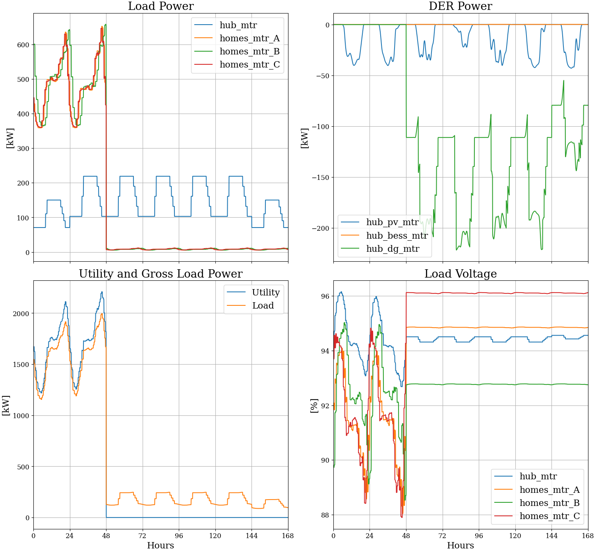
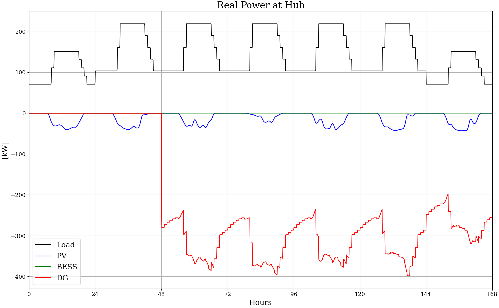
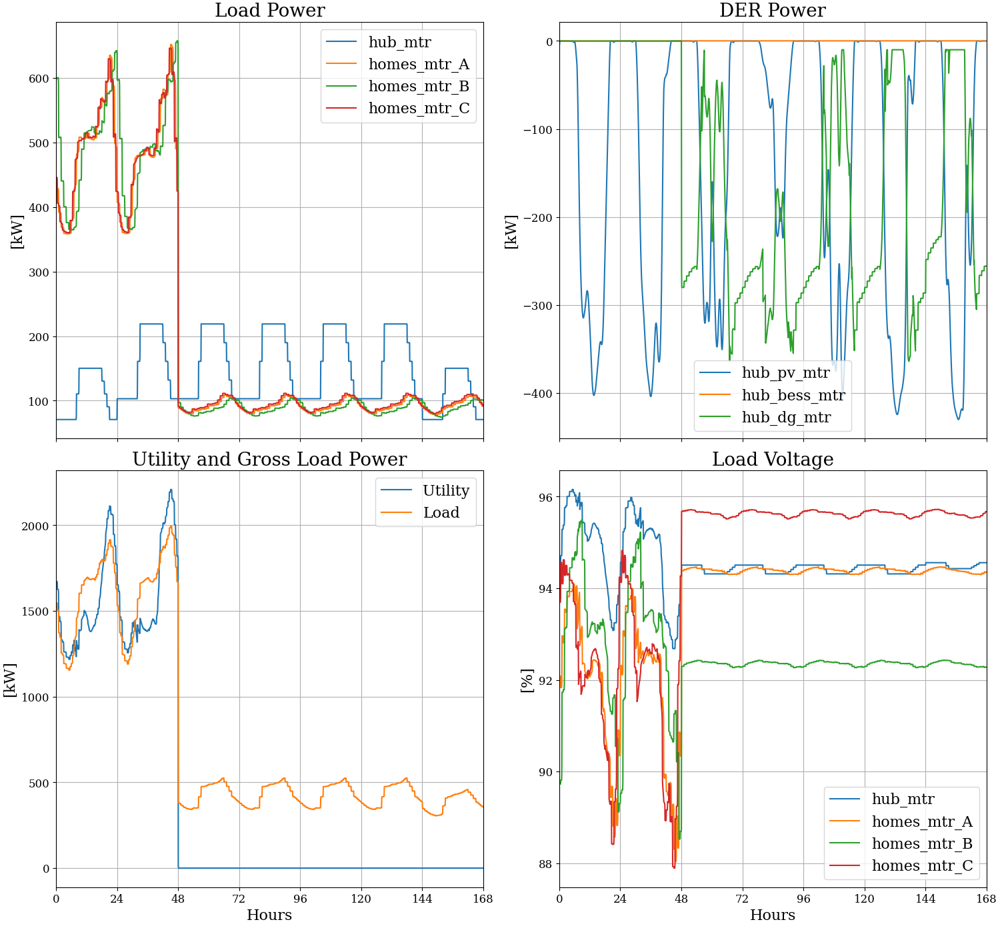
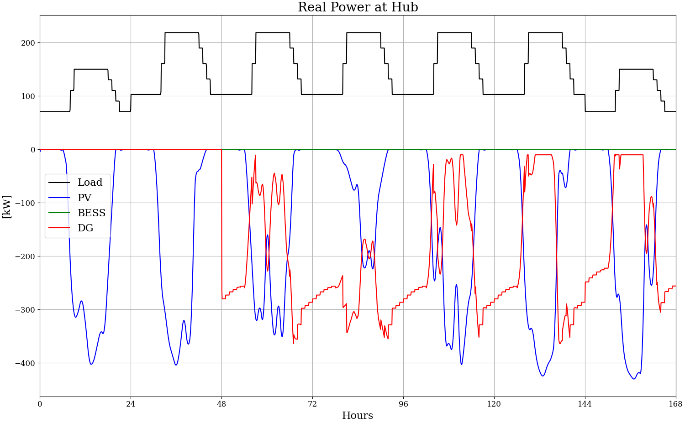
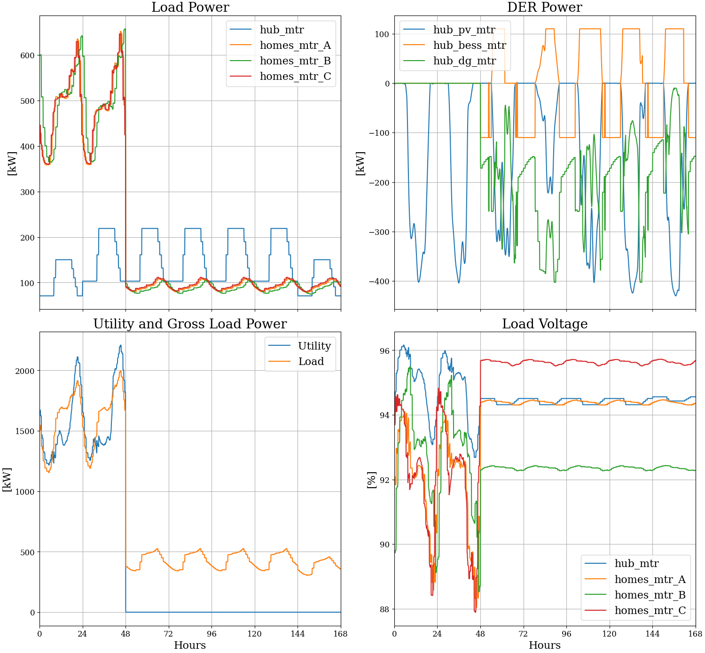
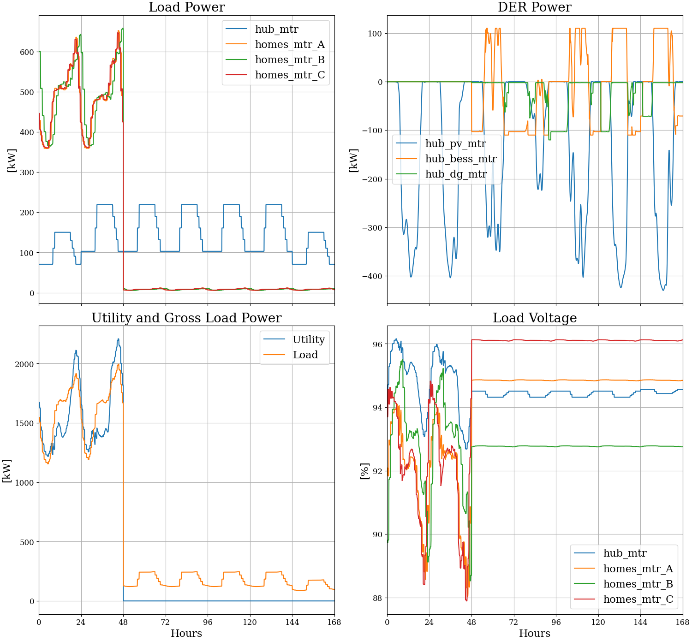
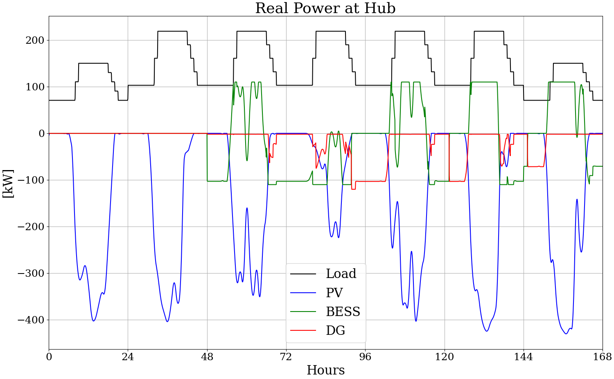

# Socio-Grid Co-simulation (SOCO) Example

This example uses GridLAB-D, HELICS, and a custom Python agent
to produce metrics for a community resilience hub, including
energy and environmental justice (EEJ) factors. It provides a
starting point for sprint studies that include EEJ factors.

[Summary](soco_test.pdf)

## Steps to run simulations:

This example has been tested on Ubuntu, not Windows.

1. Need `pip3 install tesp_support`, and Helics
2. `python3 prepare_case.py` to make a weather file, and GridLAB-D metrics dictionary
3. `./testglm.sh` to run a time-series power flow, without events
4. `python3 plots.py` to summarize and plot metrics
5. `./run.sh` to run a HELICS federation that simulates a utility outage after 2 days
6. `python3 plots.py` again to summarize and plot metrics

The SOCO agent is in *soco.py*, configured in socoConfig.json:

1. Opens the utility switch after 2 days
2. During the event, controls battery discharging and charging
3. During the event, dispatches the diesel generator as a swing machine
4. At the event start, suppresses some of the non-critical load in homes
   (Because of the internal GridLAB-D schedule implementation, these messages
    have to be sent repeatedly. In TESP, schedules are implemented in the agents
    to avoid repeated messages, which are very inefficient. An alternative
    might be to shed load components by opening switches, which would have
    to be added to *soco\_test.glm*)

The Diesel Generator (DG) is 600 kW, 650 kVA, $0.5/kwh, 2.3 lbs CO2/kwh, 0.221 lbs PM/kwh

## Results

The following scenarios compare metrics based on 7-day simulations. In the
first "blue sky" case, the utility source is not interrupted. In the remaining
five cases, the utility source interrupts two days into the simulation.

The tabulated results include:

- Total electric bill for the week, in dollars
- Columns for each meter location:
    - Electric bill, in dollars
    - Energy delivered, in kwh
    - Maximum voltage, in percent
    - Minimum voltage, in percent
    - Hours out of service
    - Hours below the ANSI C84.1 B range, i.e., below 91.67% of normal voltage
    - Hours below the ANSI C84.1 A range, i.e., below 95.00% of normal voltage
- Energy delivered to homes outside the Hub, during the 5 outage days, in kwh

### Blue Sky Conditions

Includes utility source, minimal 10 W battery, 50 kW PV at full irradiance, DG not running.
The command `./testglm.sh` runs this case without opening the utility switch.





```
Total meter bill = 271357.053
Meter Name         Bill     Energy    Vmax    Vmin HrsOut HrsBLO HrsALO
hub_mtr        11944.49   23876.99 96.2949 92.8285   0.00   0.00 117.01
homes_mtr_A    40425.25   80838.51 94.2323 88.1862   0.00 105.01 168.00
homes_mtr_B    41278.72   82545.45 95.1308 88.6606   0.00  40.06 161.08
homes_mtr_C    40544.66   81077.33 95.0448 88.0395   0.00  95.06 166.06
fdr_head      140930.25  281848.49 99.6419 99.1370   0.00   0.00   0.00
hub_bess_mtr       5.16      -1.68 96.3557 92.9486   0.00   0.00 116.95
hub_dg_mtr        -9.12     -30.24 96.3557 92.9486   0.00   0.00 116.95
hub_pv_mtr     -3762.37   -7536.73 96.3557 92.9486   0.00   0.00 116.95
Home kWH = 174626.54 over points 576 to 2016
```

### Utility Outage; Non-Hub Refrigerators Off During Outage

Includes minimal 10 W battery, 50 kW PV, Refrigerators off during outage.
It is assumed that loads outside the community resilience hub would
be disconnected, as may be current practice.




```
Total meter bill = 79396.960
Meter Name         Bill     Energy    Vmax    Vmin HrsOut HrsBLO HrsALO
hub_mtr        11944.49   23877.23 96.1547 92.6807   0.00   0.00 153.01
homes_mtr_A    12020.00   24027.81 94.8976 88.0370   0.00  30.09 168.00
homes_mtr_B    12243.63   24475.34 95.0350 88.5269   0.00  14.60 167.51
homes_mtr_C    12061.98   24111.79 96.1569 87.8932   0.00  29.26  50.30
fdr_head       40704.87   81396.58 99.6265 94.6223   0.00   0.00 120.00
hub_bess_mtr       6.30       0.60 96.2157 92.8012   0.00   0.00 153.00
hub_dg_mtr     -8493.88  -16999.81 96.2157 92.8012   0.00   0.00 153.00
hub_pv_mtr     -1090.44   -2192.84 96.2157 92.8012   0.00   0.00 153.00
Home kWH = 2924.22 over points 576 to 2016
```
### Utility Outage; Non-Hub Refrigerators On During Outage

Includes minimal 10 W battery, 50 kW PV, Refrigerators on during outage.
It is assumed that community members would voluntarily turn off all
electric loads outside of the hub, except for refrigerators.




```
Total meter bill = 84573.247
Meter Name         Bill     Energy    Vmax    Vmin HrsOut HrsBLO HrsALO
hub_mtr        11944.49   23877.23 96.1547 92.6807   0.00   0.00 153.01
homes_mtr_A    17062.16   34112.14 94.4943 88.0370   0.00  30.11 168.00
homes_mtr_B    17070.69   34129.45 95.0350 88.5269   0.00  15.03 167.51
homes_mtr_C    17238.02   34463.87 95.7500 87.8932   0.00  29.26  50.77
fdr_head       40704.87   81396.58 99.6265 94.6223   0.00   0.00 120.00
hub_bess_mtr       6.30       0.60 96.2157 92.8012   0.00   0.00 153.00
hub_dg_mtr    -18362.85  -36737.88 96.2157 92.8012   0.00   0.00 153.00
hub_pv_mtr     -1090.44   -2192.84 96.2157 92.8012   0.00   0.00 153.00
Home kWH = 33014.74 over points 576 to 2016
```
### Increased Solar (Refrigerators On)

Includes a minimal 10 W battery, 500 kW PV, Refrigerators on during outage.




```
Total meter bill = 78249.405
Meter Name         Bill     Energy    Vmax    Vmin HrsOut HrsBLO HrsALO
hub_mtr        11944.49   23877.23 96.1577 92.6807   0.00   0.00 137.82
homes_mtr_A    17171.39   34330.58 94.4943 88.0371   0.00  15.03 168.00
homes_mtr_B    17162.95   34313.95 95.5117 88.5269   0.00  14.70 164.85
homes_mtr_C    17346.33   34680.49 95.7500 87.8932   0.00  13.10  50.77
fdr_head       37628.82   75244.75 99.6268 94.6223   0.00   0.00 120.00
hub_bess_mtr       6.79       1.57 96.2186 92.8012   0.00   0.00 136.83
hub_dg_mtr    -12053.00  -24118.18 96.2186 92.8012   0.00   0.00 136.83
hub_pv_mtr    -10958.36  -21928.40 96.2186 92.8012   0.00   0.00 136.83
Home kWH = 33014.74 over points 576 to 2016
```
### Hybrid Solar plus Storage (Refrigerators On)

Includes 110 kW battery, 500 kW PV, Refrigerators on during outage.




```
Total meter bill = 78571.028
Meter Name         Bill     Energy    Vmax    Vmin HrsOut HrsBLO HrsALO
hub_mtr        11944.49   23877.23 96.1577 92.6807   0.00   0.00 137.82
homes_mtr_A    17171.39   34330.58 94.4943 88.0371   0.00  15.03 168.00
homes_mtr_B    17162.95   34313.95 95.5117 88.5269   0.00  14.70 164.85
homes_mtr_C    17346.33   34680.49 95.7500 87.8932   0.00  13.10  50.77
fdr_head       37628.82   75244.75 99.6268 94.6223   0.00   0.00 120.00
hub_bess_mtr      30.04      48.00 96.2186 92.8012   0.00   0.00 136.83
hub_dg_mtr    -11754.63  -23521.36 96.2186 92.8012   0.00   0.00 136.83
hub_pv_mtr    -10958.36  -21928.40 96.2186 92.8012   0.00   0.00 136.83
Home kWH = 33014.74 over points 576 to 2016
```
### Hub-Only Case with Small Diesel Generator and Refrigerators Off

Includes a 110 kW battery, 500 kW PV, Refrigerators off during outage, smaller 30-kW DG.
Although refrigerators outside the hub would lose service, this scenario
shows how the community resiliance hub could be operated with a DG 20 times
smaller than the existing DG.





```
Total meter bill = 73095.682
Meter Name         Bill     Energy    Vmax    Vmin HrsOut HrsBLO HrsALO
hub_mtr        11944.49   23877.23 96.1577 92.6807   0.00   0.00 137.82
homes_mtr_A    12129.22   24246.25 94.8976 88.0371   0.00  15.01 168.00
homes_mtr_B    12335.89   24659.84 95.5117 88.5269   0.00  14.27 164.85
homes_mtr_C    12170.29   24328.41 96.1569 87.8932   0.00  13.10  50.30
fdr_head       37628.82   75244.75 99.6268 94.6223   0.00   0.00 120.00
hub_bess_mtr    -749.86   -1511.77 96.2186 92.8012   0.00   0.00 136.83
hub_dg_mtr     -1404.82   -2821.64 96.2186 92.8012   0.00   0.00 136.83
hub_pv_mtr    -10958.36  -21928.40 96.2186 92.8012   0.00   0.00 136.83
Home kWH = 2924.22 over points 576 to 2016
```
